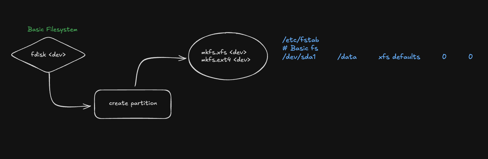
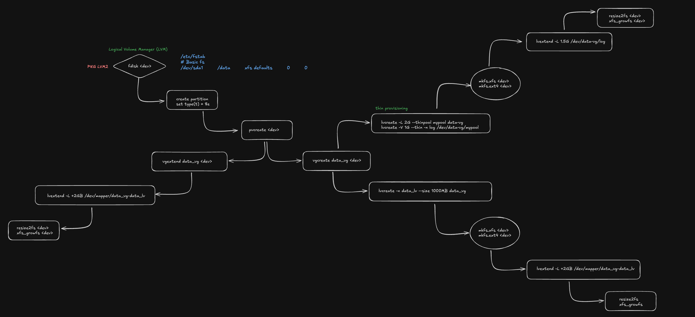
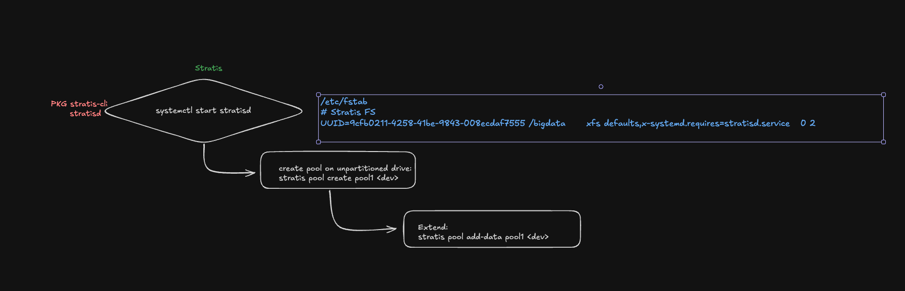
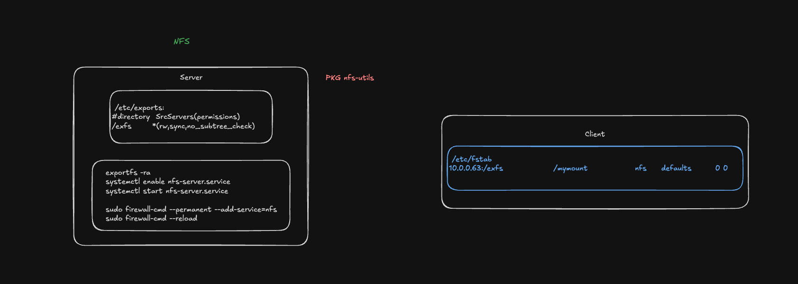

# Notes for the RHCSA exam EX-200
https://www.redhat.com/de/services/certification/rhcsa?pfe-7d312plns=exams

# Table of Contents
<!-- TOC tocDepth:2..3 chapterDepth:2..6 -->

- [Exam Path](#exam-path)
- [Links](#links)
- [Redirecting Input/Output](#redirecting-inputoutput)
- [User management](#user-management)
  - [Add/modify/delete](#addmodifydelete)
  - [Password aging](#password-aging)
  - [Password quality](#password-quality)
  - [Sudo](#sudo)
- [File Permissions](#file-permissions)
- [Control Services and daemons](#control-services-and-daemons)
  - [systemctl enable and systemctl disable](#systemctl-enable-and-systemctl-disable)
  - [systemctl mask and systemctl unmask](#systemctl-mask-and-systemctl-unmask)
- [SSH](#ssh)
  - [Config](#config)
  - [Setup Keys](#setup-keys)
- [Time Synchronization](#time-synchronization)
- [Manage Linux Networking](#manage-linux-networking)
  - [NetworkManager](#networkmanager)
- [Kernal related items](#kernal-related-items)
  - [Setting kernel parameters at runtime](#setting-kernel-parameters-at-runtime)
  - [Install Kernel updates](#install-kernel-updates)
- [Set Linux to boot of index 1 in the boot menu](#set-linux-to-boot-of-index-1-in-the-boot-menu)
- [FTP (vsftpd - server proc)](#ftp-vsftpd---server-proc)
  - [Server installation](#server-installation)
- [Client side FTP](#client-side-ftp)
- [Package Manager](#package-manager)
  - [Repos](#repos)
  - [Erase / Remove packages](#erase-remove-packages)
  - [downloading and installing packages](#downloading-and-installing-packages)
  - [downloading and installing packages](#downloading-and-installing-packages)
  - [List config files for package](#list-config-files-for-package)
  - [List config file for package](#list-config-file-for-package)
  - [Redhat Verisoning](#redhat-verisoning)
  - [Make a local repo](#make-a-local-repo)
- [Server Dump and support](#server-dump-and-support)
  - [Cockpit - web based interface for servers](#cockpit---web-based-interface-for-servers)
- [Shells](#shells)
  - [What is my shell?:](#what-is-my-shell)
  - [What shells are installed?:](#what-shells-are-installed)
- [Tuning](#tuning)
  - [tuned and tuned-adm](#tuned-and-tuned-adm)
  - [nice and renice](#nice-and-renice)
- [ACL's](#acls)
  - [Examples](#examples)
- [SELinux (Security Enhanced Linux)](#selinux-security-enhanced-linux)
  - [2 ways to run SELinux](#2-ways-to-run-selinux)
  - [get status](#get-status)
  - [set status](#set-status)
  - [Config](#config)
  - [2 Main conepts of SELinux](#2-main-conepts-of-selinux)
  - [Managing SELinux](#managing-selinux)
- [Storage](#storage)
  - [Adding a Volume](#adding-a-volume)
  - [LVM](#lvm)
  - [Extending LVM's](#extending-lvms)
  - [Create a 1GB thin-provisioned volume](#create-a-1gb-thin-provisioned-volume)
  - [Extending the thin-provisioned volume](#extending-the-thin-provisioned-volume)
  - [Stratis (advanced storage management)](#stratis-advanced-storage-management)
  - [FS snapshot](#fs-snapshot)
  - [Mounting a Stratis Filesystem](#mounting-a-stratis-filesystem)
  - [NFS (Network File System)](#nfs-network-file-system)
  - [SAMBA / CIFS (mounting non linux FS's)](#samba-cifs-mounting-non-linux-fss)
  - [Secure Samba](#secure-samba)
  - [VDO](#vdo)
- [Boot Process](#boot-process)
- [Systemd Targets](#systemd-targets)
  - [Check current target](#check-current-target)
  - [Targets can have dependancies](#targets-can-have-dependancies)
  - [Display which runlevel is linked to which targets](#display-which-runlevel-is-linked-to-which-targets)
  - [Change default target](#change-default-target)
  - [Enable grub to log in debug](#enable-grub-to-log-in-debug)
- [Repair file system corruption](#repair-file-system-corruption)
- [Firewalld](#firewalld)
  - [Install](#install)
  - [Get predifined services that can be referenced to enable / disable](#get-predifined-services-that-can-be-referenced-to-enable-disable)
  - [Get Zones and rules](#get-zones-and-rules)
  - [Add a service temporarily](#add-a-service-temporarily)
  - [Add a service Permanantly](#add-a-service-permanantly)
  - [Add 3rd Party Service](#add-3rd-party-service)
  - [Add a Port](#add-a-port)
  - [Regect incomming connection from an IP](#regect-incomming-connection-from-an-ip)
  - [Regect incomming connection ping traffic](#regect-incomming-connection-ping-traffic)
  - [DROP outgoing traffic to a specific IP](#drop-outgoing-traffic-to-a-specific-ip)
- [Containers (podman)](#containers-podman)
  - [Install](#install)
  - [See what registries exist](#see-what-registries-exist)
  - [Find an image](#find-an-image)
  - [Download image](#download-image)
  - [Run container](#run-container)
  - [Stop container](#stop-container)
  - [Create a new container from the downloaded image](#create-a-new-container-from-the-downloaded-image)
  - [Manage containers using systemd](#manage-containers-using-systemd)
  - [Setup a local repository](#setup-a-local-repository)
  - [Custom container](#custom-container)
- [Create swap](#create-swap)
- [Turn on SELinux policy container_manage_cgroup with persistance](#turn-on-selinux-policy-container_manage_cgroup-with-persistance)
- [How to put grub into debug](#how-to-put-grub-into-debug)
- [2 Methods to change the root password when you dont know it.](#2-methods-to-change-the-root-password-when-you-dont-know-it)
  - [How to replace root pwd the new way](#how-to-replace-root-pwd-the-new-way)
  - [How to replace root pwd with rd.break](#how-to-replace-root-pwd-with-rdbreak)
- [convert epoch to real date time](#convert-epoch-to-real-date-time)
- [ausearch | aureport](#ausearch-aureport)
- [Adding files to all users created](#adding-files-to-all-users-created)
- [Activating a service in firewalld](#activating-a-service-in-firewalld)
- [Change Keyboard to swiss german](#change-keyboard-to-swiss-german)
- [Sctipting notes](#sctipting-notes)
- [tar using bzip and then extract the data to dir /restore](#tar-using-bzip-and-then-extract-the-data-to-dir-restore)
- [Prohibit root login over ssh](#prohibit-root-login-over-ssh)
- [Troubleshooting systemd](#troubleshooting-systemd)
- [Setup Centralized logging](#setup-centralized-logging)
  - [Log Server](#log-server)
  - [Sender Server](#sender-server)
  - [Tail to see if you see the log entries on the log Server](#tail-to-see-if-you-see-the-log-entries-on-the-log-server)
  - [usr creation scrpt](#usr-creation-scrpt)
- [Tuned](#tuned)
  - [To list the profiles](#to-list-the-profiles)
  - [Apply Profile](#apply-profile)
  - [Check active profile](#check-active-profile)
  - [Create custom profile](#create-custom-profile)
- [Script concepts](#script-concepts)
  - [Overview](#overview)
  - [Using RegEx to check if a var is an INT:](#using-regex-to-check-if-a-var-is-an-int)
  - [Passing a var into a Function](#passing-a-var-into-a-function)
- [Locking a user account](#locking-a-user-account)
  - [lock an account from being logged in (still avail to root/ and user if pubkey is setup)](#lock-an-account-from-being-logged-in-still-avail-to-root-and-user-if-pubkey-is-setup)
  - [lock an account from being logged in (ONLY avail to root)](#lock-an-account-from-being-logged-in-only-avail-to-root)
- [Sudoers](#sudoers)
  - [Grant sudo privileges a new user caladin](#grant-sudo-privileges-a-new-user-caladin)
- [sticky bits and SETUID and SETGID bits](#sticky-bits-and-setuid-and-setgid-bits)
  - [Sticky bit](#sticky-bit)
  - [SETUID](#setuid)
  - [SETGID](#setgid)
- [Nuances with permissioning](#nuances-with-permissioning)
  - [Write Permissions on a Directory (Without Execute):](#write-permissions-on-a-directory-without-execute)
  - [Removing Execute Permission from a Directory Disables Navigation:](#removing-execute-permission-from-a-directory-disables-navigation)
  - [Symbolic Link Permissions:](#symbolic-link-permissions)
  - [Umask Influencing Default Permissions:](#umask-influencing-default-permissions)
- [RAID](#raid)
  - [Overview](#overview)
  - [Setup RAID 0 (striping)](#setup-raid-0-striping)
  - [Setup RAID 1 (Mirroring)](#setup-raid-1-mirroring)
  - [Setup RAID 5 (Striping with Parity)](#setup-raid-5-striping-with-parity)
- [journal](#journal)
  - [Config](#config)
  - [Basic Usage](#basic-usage)
- [Check the change log for a package:](#check-the-change-log-for-a-package)
- [TODO](#todo)

<!-- /TOC -->

# RH124
## Exam Path
1. `EX200 RHCSA` -> tests your knowledge and skills in general system administration for a wide variety of environments and development scenarios. You must be an RHCSA to earn certification as a Red Hat Certified Engineer (RHCE®) .
2. `EX294 RHCE` ->  focuses on automation skills and is based on Red Hat Enterprise Linux 8

---
## Links

* `ln` `src_file` `target name` will create a hard link 
* `ln -s` `src_file` `target name` will create a soft link

A hard link will link direct to the inode whereas softlink will link to a filename. With hard links you the source target or src can be removed an and the other will still work unlike with soft links.

---

## Redirecting Input/Output
3 redirects in Linux:

|*redirect*|*descriptor* |
|----------|-------------|
|stdin     |0            |
|stdout    |1            |
|stderr    |2            |

example to redirect `stderr`:
```
[root@centos1 ~]# telnet centos2 21342 2> error.log
[root@centos1 ~]# cat error.log
telnet: centos2: Name or service not known
centos2: Unknown host
```

example to redirect `stderr` to `stdout`:
* Here, `ls` will try to list a non-existent directory. The error message, which would normally go to stderr, but here  it will redirect stderr to the same destination as stdout.
```
[root@centos1 ~]# ls /nonexistentdirectory > output.txt 2>&1
[root@centos1 ~]# cat output.txt
ls: cannot access '/nonexistentdirectory': No such file or directory
[root@centos1 ~]#

```
NOTE:
* `cmd &> /dev/null` VS `cmd > /dev/null 2>&1`

`cmd &> /dev/null` and `cmd > /dev/null 2>&1` both perform the same function: they redirect both standard output (stdout) and standard error (stderr) to /dev/null, effectively silencing all output from the command.


___
## User management
### Add/modify/delete
to Check if a user exists:
`id <username>`

Commands:
* `useradd <username>` : Will create the user and group with same name and create a homedir permissioned for that user
* `groupadd <groupname>` : will add a group
* `userdel <username>` : will delete a user
* `groupdel <groupname>` : will delete a group
* `usermod <username>` : will modify a user

#### To add a User
`useradd -g superheros -s /bin/bash -c "CEO Stark Industries" -m -d /home/ironman ironman`

In this case we specify `-m` but if `CREATE_HOME` is `yes` then it is not needed
```
[root@rh21 ~]# grep CREATE_HOME /etc/login.defs
CREATE_HOME	yes
```

#### To change the users shell
`usermod -s /bin/zsh ironman`


To add a user to a group :
`usermod -a -G <group> <user>` this APPEND a group to the user

To replace the groups of a user :
`usermod -G <group> <user>` this will remove existing groups


### Password aging

Default config : `/etc/login.defs`
* if you change this file it will be active for any new logins created. 
* Changes to aging and expiration will take affect when the user changes the passwd.
```
                              <---Snippet--->
# Password aging controls:
#
#       PASS_MAX_DAYS   Maximum number of days a password may be used.
#       PASS_MIN_DAYS   Minimum number of days allowed between password changes.
#       PASS_MIN_LEN    Minimum acceptable password length.
#       PASS_WARN_AGE   Number of days warning given before a password expires.
#
PASS_MAX_DAYS   99999
PASS_MIN_DAYS   0
PASS_WARN_AGE   7
                              <---Snippet--->
#
# Min/max values for automatic uid selection in useradd(8)
#
UID_MIN                  1000
UID_MAX                 60000
                              <---Snippet--->
#
ENCRYPT_METHOD SHA512
                              <---Snippet--->
#
# Should login be allowed if we can't cd to the home directory?
# Default is yes.
#
#DEFAULT_HOME   yes
                              <---Snippet--->
#
# If useradd(8) should create home directories for users by default (non
# system users only).
# This option is overridden with the -M or -m flags on the useradd(8)
# command-line.
#
CREATE_HOME     yes

```
The `chage` command `( NOT PWAGE!!!! )` changes the number of days between password changes and the date of the last password change. This information is used by the system to determine when a user
       must change their password.

CMDLINE: `chage -d <lastday> -m <mindays> -M <maxdays> -W <warndays> -I -E <expiredate> USERNAME`
* `-d <last days>` is the # of days since 1970 since last change. Probably wouldnt want to change that, unless needed

eg: `chage -m 5 -M 90 -W 10 -I 3 -E 30 bababutt` results in :
ironman:$6$Sa3CEa7va56INP3Q$zC4sGsgJAn0RjeYfD4Yh5STzc7CSV6oRez3jgb0tvkygUGxa3R.lNgnQvDF/K5W8bQZZUUjWjdDBt4RcOOx2l0:19949:`5`:`90`:`10`:`3`:`30`:

### Password quality
```
[root@rhel security]# cat /etc/security/pwquality.conf
# Configuration for systemwide password quality limits
# Defaults:
                         <---Snippet--->
# Minimum acceptable size for the new password (plus one if
# credits are not disabled which is the default). (See pam_cracklib manual.)
# Cannot be set to lower value than 6.
minlen = 9
                          <---Snippet--->
# The maximum number of allowed consecutive same characters in the new password.
# The check is disabled if the value is 0.
# maxrepeat = 0
```

### Sudo
to add a user to get access to run root commands add the user to group `wheel` :

`usermod -aG wheel aryan`
___

## File Permissions
* you need `execute` rights to `cd` into a directory
* if a file owned by root:root exists in a user directory, the user can remove the file because he is the owner of the directory and has `rwx` on the directory.

___
## Control Services and daemons
* Systemd is the first proc started on the system with PID `1`
```
[root@centos1 ~]# ps  -fp 1
UID          PID    PPID  C STIME TTY          TIME CMD
root           1       0  0 Aug13 ?        00:00:06 /usr/lib/systemd/systemd --switched-root --system --deserialize 31
```

* Check all services with `systemctl -all` 
```
[root@centos1 ~]# systemctl -all
  UNIT                                                                                 LOAD      ACTIVE   SUB       DESCRIPTION                                                               >
● boot.automount                                                                       not-found inactive dead      boot.automount
  proc-sys-fs-binfmt_misc.automount                                                    loaded    active   waiting   Arbitrary Executable File Formats File System Automount Point             >
  dev-disk-by\x2ddiskseq-1.device                                                      loaded    active   plugged   /dev/disk/by-diskseq/1
  dev-disk-by\x2ddiskseq-2.device                                                      loaded    active   plugged   /dev/disk/by-diskseq/2
  dev-disk-by\x2dlabel-config\x2d2.device                                              loaded    active   plugged   /dev/disk/by-label/config-2
  dev-disk-by\x2dpartlabel-BIOS\x5cx20Boot\x5cx20Partition.device                      loaded    active   plugged   /dev/disk/by-partlabel/BIOS\x20Boot\x20Partition
  ...  
  ```

### systemctl enable and systemctl disable
These commands are used to control whether a service starts automatically at boot.

* `enable`-  you create a symbolic link in the system’s service directories (usually /etc/systemd/system/) that tells systemd to start the service automatically during boot.
* `disable`- When you disable a service, you remove the symbolic link, so systemd no longer starts the service automatically during boot.

### systemctl mask and systemctl unmask
These commands are used to completely prevent a service from being started, either manually or automatically.

* `mask`- When you mask a service, you create a symbolic link that points to `/dev/null`, effectively blocking the service from being started by any means *(including manually using systemctl start)*.

* `unmask`- When you unmask a service, you remove the symbolic link pointing to /dev/null, allowing the service to be started manually or automatically again.
___

## SSH
### Config
Config : `/etc/ssh/sshd_config`
* Some important config params:

```
ClientAliveInterval 600 # Configure Idle Timeout Interval (auto logout when not used)
ClientAliveCountMax 0 

PermitRootLogin no      # disable root login over ssh
AllowUsers aryan cnory  # restrict ssh to these users

Port 22                 # runs on 22 by default, can be changed
```

### Setup Keys
STEP 1

    ssh- keygen

STEP 2

    ssh-copy-id root@x.x.x.x

STEP 3

    ssh root@x.x.x.x

Best Practise:

The best practice is to generate a separate SSH key pair for each server. Here's why:

<b>Security</b>: If one SSH key is compromised, the attacker gains access to only one direction of communication. This limits potential damage and provides a more granular level of control over access.

<b>Auditability</b>: It becomes easier to manage and audit which keys are in use and for what purpose. You can easily revoke or rotate keys on a per-server basis without affecting the other server.

<b>Flexibility</b>: If you ever need to change the key or restrict access, having separate keys makes it easier to manage these changes without interrupting access between servers.

___
## Time Synchronization

`timedatectl`is used 
```
[root@centos8 log]# timedatectl
               Local time: Mi 2024-08-14 14:47:18 UTC
           Universal time: Mi 2024-08-14 14:47:18 UTC
                 RTC time: Mi 2024-08-14 14:47:18
                Time zone: UTC (UTC, +0000)
System clock synchronized: yes
              NTP service: active
          RTC in local TZ: no
```

`timedatectl list-timezones` will give you a list of the timezones and you can set it with :
`timedatectl set-timezone Europe/Berlin`

Chronyd config is stored here :
 `/etc/chrony.conf`

To add a source:
```
# Please consider joining the pool (https://www.pool.ntp.org/join.html).
pool 2.centos.pool.ntp.org iburst
pool 0.centos.pool.ntp.org iburst           <- add this
```

DON'T USE NTP AND CHRONYD. CHRONYD HAS SUPERCEEDED IT !

 you can check the chrony sync using `chronyc`
```
[root@centos2 etc]# chronyc sources
MS Name/IP address         Stratum Poll Reach LastRx Last sample
===============================================================================
^- mail2.light-speed.de          2   6    37    10   +425us[ +425us] +/-   14ms
^* ntp01.pingless.com            2   6    37    11   +109us[  -38us] +/- 4033us
^- 185.252.140.125               2   6    57     7   -556us[ -556us] +/-   13ms
^- dc8wan.de                     2   6    37    11   -336us[ -336us] +/-   27ms
^- srv02.spectre-net.de          2   6    37    11  +1576ns[+1576ns] +/- 6378us
^- hc.gommels-bienen.de          2   6    37    10   +561us[ +561us] +/-   53ms
^- static.81.54.251.148.cli>     2   6    37    11   +307us[ +160us] +/-   51ms
^- de-fra2-ntp1.level66.net>     2   6    37    11  -1146us[-1293us] +/-   32ms
```

To force a Sync
```
chronyc -a 'burst 4/4'
chronyc makestep
```

___
## Manage Linux Networking
* `yum install bind-utils` to install nslookup etc.
* `yum install net-tools` to install netstat etc.

### NetworkManager

#### Important files:
* <b>directory</b>: `/etc/sysconfig/network-scripts`
```
[root@centos2 network-scripts]# cat ifcfg-eth0
# Created by cloud-init on instance boot automatically, do not edit.
#
AUTOCONNECT_PRIORITY=120
BOOTPROTO=none                      <-- static       
DEFROUTE=yes
DEVICE=eth0
GATEWAY=64.226.80.1
HWADDR=12:f6:3a:f7:fe:2e
IPADDR=64.226.83.19
IPADDR1=10.19.0.5
MTU=1500
NETMASK=255.255.240.0
NETMASK1=255.255.0.0
ONBOOT=yes
TYPE=Ethernet
USERCTL=no
```
* <b>file</b>: /etc/hosts
* <b>file</b>: /etc/hostname
* <b>file</b>: /etc/resolv.conf -> list of dns servers
* <b>file</b>: /etc/nsswitch.conf -> how to resolve names, first files then dns etc.

#### nmcli
`nmcli` (Network Manager Command Line Interface):
* `nmcli` is a command-line tool used to interact with NetworkManager and manage network settings, such as configuring and controlling network interfaces, setting up network connections (e.g., Ethernet, Wi-Fi), and viewing network status.

```
nmcli connection modify 5fb06bd0-0bb0-7ffb-45f1-d6edd65f3e03 ipv4.addresses 64.226.76.183/24
nmcli connection modify 5fb06bd0-0bb0-7ffb-45f1-d6edd65f3e03 ipv4.gateway 192.168.1.1
nmcli connection modify 5fb06bd0-0bb0-7ffb-45f1-d6edd65f3e03 ipv4.dns "8.8.8.8 8.8.4.4"
nmcli connection modify 5fb06bd0-0bb0-7ffb-45f1-d6edd65f3e03 ipv4.method manual
nmcli connection reload
```


#### nmcli - adding a second IP
```
[root@rh23 ]# nmcli c show
NAME    UUID                                  TYPE      DEVICE
enp0s1  8aeefc3d-8952-36a0-8e9b-288bee11d438  ethernet  enp0s1
lo      be80dabe-73c1-48ea-a6cd-6abed5165636  loopback  lo

[root@rh23 ]# nmcli c  mod 8aeefc3d-8952-36a0-8e9b-288bee11d438 +ipv4.addresses 10.0.0.212/24

[root@rh23 ]# nmcli con up 8aeefc3d-8952-36a0-8e9b-288bee11d438

[root@rh23 ]# ip a
2: enp0s1: <BROADCAST,MULTICAST,UP,LOWER_UP> mtu 1500 qdisc fq_codel state UP group default qlen 1000
    link/ether 1e:d9:b1:28:22:9f brd ff:ff:ff:ff:ff:ff
    inet 10.0.0.77/24 brd 10.0.0.255 scope global noprefixroute enp0s1
       valid_lft forever preferred_lft forever
    inet 10.0.0.212/24 brd 10.0.0.255 scope global secondary noprefixroute enp0s1
       valid_lft forever preferred_lft forever
```
#### nmtui
`nmtui` (Network Manager Text User Interface):
* `nmtui` provides a text-based user interface for managing network settings, allowing users to configure network connections using a menu-driven interface in the terminal.
Usage Scenarios: Useful for users who prefer a semi-graphical interface or are working in a non-GUI environment, such as a server, and need a more user-friendly tool than nmcli to configure networks.


#### nm-connection-editor
`nm-connection-editor`:
* `nm-connection-editor` is a graphical tool used to create, edit, and manage network connections. It provides a GUI interface for configuring all types of network connections, including wired, wireless, VPN, and more.


#### Important commands
##### ping

##### ifconfig / ip


##### ifup / ifdown
-> interface up / interface down

#### netstat
```
[root@centos1 ~]# netstat -rnv
Kernel IP routing table
Destination     Gateway         Genmask         Flags   MSS Window  irtt Iface
0.0.0.0         164.90.176.1    0.0.0.0         UG        0 0          0 eth0
10.19.0.0       0.0.0.0         255.255.0.0     U         0 0          0 eth0
10.114.0.0      0.0.0.0         255.255.240.0   U         0 0          0 eth1
164.90.176.0    0.0.0.0         255.255.240.0   U         0 0          0 eth0
```


##### traceroute


##### tcpdump
```
[root@centos1 sshd_config.d]# tcpdump -i eth0
dropped privs to tcpdump
tcpdump: verbose output suppressed, use -v[v]... for full protocol decode
listening on eth0, link-type EN10MB (Ethernet), snapshot length 262144 bytes
06:41:49.711264 IP centos1.ssh > xdsl-188-154-47-102.adslplus.ch.50406: Flags [P.], seq 2949716432:2949716492, ack 3838753987, win 1002, options [nop,nop,TS val 1355438850 ecr 1729410591], length 60
06:41:49.711317 IP centos1.ssh > xdsl-188-154-47-102.adslplus.ch.50406: Flags [P.], seq 60:96, ack 1, win 1002, options [nop,nop,TS val 1355438850 ecr 1729410591], length 36
06:41:49.711513 IP centos1.ssh > xdsl-188-154-47-102.adslplus.ch.50406: Flags [P.], seq 96:204, ack 1, win 1002, options [nop,nop,TS val 1355438850 ecr 1729410591], length 108
```
##### nslookup / dig

##### ethtool
```
# ethtool eth0
Settings for eth0:
	Supported ports: [  ]
	Supported link modes:   Not reported
	Supported pause frame use: No
	Supports auto-negotiation: No
	Supported FEC modes: Not reported
	Advertised link modes:  Not reported
	Advertised pause frame use: No
```
___
## Kernal related items

### Setting kernel parameters at runtime
* We use `sysctl` for this, you can also add setting to a file called `/etc/sysctl.conf` and then run `sysctl -p ` to activate the setting at runtime. The `-p` option will reread the `/etc/sysctl.conf` file by default or you could specify ARG1 as a custom file.
* Here we will enable ip forwarding as an example:

```
sysctl -a                                       <- priovide all current settings

[root@localhost ~]# sysctl -a | grep -i net.ipv4.ip_forward
net.ipv4.ip_forward = 0
net.ipv4.ip_forward_update_priority = 1
net.ipv4.ip_forward_use_pmtu = 0

[root@localhost ~]# vi /etc/sysctl.conf
       net.ipv4.ip_forward = 1

[root@localhost ~]# sysctl -p                    <---- to activate
net.ipv4.ip_forward = 1

[root@localhost ~]# sysctl -a | grep -i net.ipv4.ip_forward
net.ipv4.ip_forward = 1                          <----- now active
net.ipv4.ip_forward_update_priority = 1
net.ipv4.ip_forward_use_pmtu = 0

```
### Install Kernel updates
* `kernel`is with an `el` not `al`
* The command updates the Kernel and Grub by default will boot the latest kernel version. 
* Previous kernels are NOT removed

```
yum update kernel

```

## Set Linux to boot of index 1 in the boot menu
```

[root@test2 ~]# grubby --info=ALL
index=0
kernel="/boot/vmlinuz-5.14.0-427.33.1.el9_4.aarch64"
args="ro crashkernel=1G-4G:256M,4G-64G:320M,64G-:576M rd.lvm.lv=rhel/root rd.lvm.lv=rhel/swap"
root="/dev/mapper/rhel-root"
initrd="/boot/initramfs-5.14.0-427.33.1.el9_4.aarch64.img $tuned_initrd"
title="Red Hat Enterprise Linux (5.14.0-427.33.1.el9_4.aarch64) 9.4 (Plow)"
id="bdbcb356d2574e5b835bd5d17bcd1f0d-5.14.0-427.33.1.el9_4.aarch64"
index=1
kernel="/boot/vmlinuz-0-rescue-bdbcb356d2574e5b835bd5d17bcd1f0d"
args="ro crashkernel=1G-4G:256M,4G-64G:320M,64G-:576M rd.lvm.lv=rhel/root rd.lvm.lv=rhel/swap"
root="/dev/mapper/rhel-root"
initrd="/boot/initramfs-0-rescue-bdbcb356d2574e5b835bd5d17bcd1f0d.img"
title="Red Hat Enterprise Linux (0-rescue-bdbcb356d2574e5b835bd5d17bcd1f0d) 9.4 (Plow)"
id="bdbcb356d2574e5b835bd5d17bcd1f0d-0-rescue"

[root@test2 ~]# grubby --set-default-index=1
The default is /boot/loader/entries/bdbcb356d2574e5b835bd5d17bcd1f0d-0-rescue.conf with index 1 and kernel /boot/vmlinuz-0-rescue-bdbcb356d2574e5b835bd5d17bcd1f0d

[root@test2 ~]# grubby --default-kernel
/boot/vmlinuz-0-rescue-bdbcb356d2574e5b835bd5d17bcd1f0d

# This doesn't seem to be neccessary anymore !!
#[root@test2 ~]# grub2-mkconfig -o /boot/grub2/grub.cfg
#Generating grub configuration file ...
#Adding boot menu entry for UEFI Firmware Settings ...
#done
#

[root@test2 ~]# reboot

```

## FTP (vsftpd - server proc)

### Server installation
```
# yum install vsftpd
DigitalOcean Droplet Agent                                                                                                                                                                         33 kB/s | 3.3 kB     00:00
Dependencies resolved.
==================================================================================================================================================================================================================================
 Package                                             Architecture                                        Version                                                     Repository                                              Size
==================================================================================================================================================================================================================================
Installing:
 vsftpd                                              x86_64                                              3.0.5-5.el9                                                 appstream                                              168 k
 ```

 ### configure
 `vi /etc/vsftpd/vsftpd.conf`
* To enable anonymous access  :  
```
anonymous_enable=YES
anon_root=/var/ftp

```

* Set Permissions
```
sudo chown -R ftp:ftp /var/ftp/pub
sudo chmod -R 755 /var/ftp/pub
```

* Enable/Start service
```
sudo systemctl start vsftpd
sudo systemctl enable vsftpd
```

* Enable Firewall
```
sudo firewall-cmd --permanent --add-service=ftp
sudo firewall-cmd --reload            <-- This is non-disruptive to existing rules.
```


## Client side FTP
```
# yum install ftp
DigitalOcean Droplet Agent                                                                                                                                                                         56 kB/s | 3.3 kB     00:00
Dependencies resolved.
==================================================================================================================================================================================================================================
 Package                                           Architecture                                         Version                                                     Repository                                               Size
==================================================================================================================================================================================================================================
Installing:
 ftp                                               x86_64                                               0.17-89.el9                                                 appstream                                                62 k

```


```
[aryan@centos1 ~]$ ftp centos2
Connected to centos2 (64.226.83.19).
220 (vsFTPd 3.0.5)
Name (centos2:aryan):
331 Please specify the password.
Password:
230 Login successful.
Remote system type is UNIX.
Using binary mode to transfer files.
ftp> hash
Hash mark printing on (1024 bytes/hash mark).
ftp> put file.txt
local: file.txt remote: file.txt
227 Entering Passive Mode (64,226,83,19,24,117).
150 Ok to send data.
#
226 Transfer complete.
10 bytes sent in 6.5e-05 secs (153.85 Kbytes/sec)
ftp> bye
221 Goodbye.
```
___

## Package Manager

### Repos
`/etc/yum.repos.d/*`

### Erase / Remove packages
#### Using rpm -e
NOTE: Problem with this is will not remove dependancies!!!
```
$ rpm -qa |grep -i bind-utils
bind-utils-9.16.23-15.el9.x86_64
$ rpm -e bind-utils-9.16.23-15.el9.x86_64         <-- this will remove th pkg
$ rpm -qa |grep -i bind-utils
$
```


#### Using yum
```
[root@centos1 ~]# yum remove bind-utils
Dependencies resolved.
==================================================================================================================================================================================================================================
 Package                                                Architecture                                     Version                                                       Repository                                            Size
==================================================================================================================================================================================================================================
Removing:
 bind-utils                                             x86_64                                           32:9.16.23-15.el9                                             @appstream                                           644 k
Removing unused dependencies:
 bind-libs                                              x86_64                                           32:9.16.23-15.el9                                             @appstream                                           3.5 M
 bind-license                                           noarch                                           32:9.16.23-15.el9                                             @appstream                                            18 k
 fstrm                                                  x86_64                                           0.6.1-3.el9                                                   @appstream                                            55 k
 libuv                                                  x86_64                                           1:1.42.0-2.el9                                                @appstream                                           396 k
 protobuf-c                                             x86_64                                           1.3.3-13.el9                                                  @baseos                                               62 k

Transaction Summary
==================================================================================================================================================================================================================================
Remove  6 Packages

Freed space: 4.6 M
Is this ok [y/N]: y
```

### downloading and installing packages

Use `wget` to get the rpm and install using `rpm -hiv zsh-5.8-7.el9.x86_64.rpm`
```
[root@centos1 ~]# wget https://rpmfind.net/linux/centos-stream/9-stream/BaseOS/x86_64/os/Packages/zsh-5.8-7.el9.x86_64.rpm
--2024-08-15 08:49:26--  https://rpmfind.net/linux/centos-stream/9-stream/BaseOS/x86_64/os/Packages/zsh-5.8-7.el9.x86_64.rpm
Resolving rpmfind.net (rpmfind.net)... 195.220.108.108
Connecting to rpmfind.net (rpmfind.net)|195.220.108.108|:443... connected.
HTTP request sent, awaiting response... 200 OK
Length: 3398329 (3.2M) [application/x-rpm]
Saving to: ‘zsh-5.8-7.el9.x86_64.rpm’

zsh-5.8-7.el9.x86_64.rpm                                 100%[==================================================================================================================================>]   3.24M  6.81MB/s    in 0.5s

2024-08-15 08:49:27 (6.81 MB/s) - ‘zsh-5.8-7.el9.x86_64.rpm’ saved [3398329/3398329]


[root@centos1 ~]# rpm -hiv zsh-5.8-7.el9.x86_64.rpm
Verifying...                          ################################# [100%]
Preparing...                          ################################# [100%]
Updating / installing...
   1:zsh-5.8-7.el9                    ################################# [100%]
[root@centos1 ~]#
```

### downloading and installing packages
Use `rpm -qi` to query pkg information

```
[root@centos1 ~]# rpm -qi zsh-5.8-7.el9.x86_64.rpm
Name        : zsh
Version     : 5.8
Release     : 7.el9
Architecture: x86_64
Install Date: (not installed)
Group       : Unspecified
Size        : 8020813
License     : MIT
Signature   : RSA/SHA256, Fri 13 Aug 2021 06:12:56 PM UTC, Key ID 05b555b38483c65d
Source RPM  : zsh-5.8-7.el9.src.rpm
Build Date  : Tue 10 Aug 2021 06:14:26 AM UTC
Build Host  : x86-06.stream.rdu2.redhat.com
Packager    : builder@centos.org
Vendor      : CentOS
URL         : http://zsh.sourceforge.net/
Summary     : Powerful interactive shell
Description :
The zsh shell is a command interpreter usable as an interactive login
shell and as a shell script command processor.  Zsh resembles the ksh
shell (the Korn shell), but includes many enhancements.  Zsh supports
command line editing, built-in spelling correction, programmable
command completion, shell functions (with autoloading), a history
mechanism, and more.
```

### List config files for package
Here you can use `rpm -qc <PKG>`

```
[root@centos1 ~]# rpm -qc zsh-5.8-7.el9.x86_64.rpm
/etc/skel/.zshrc
/etc/zlogin
/etc/zlogout
/etc/zprofile
/etc/zshenv
/etc/zshrc
```

### List config file for package
Use `rpm -qf <FULL PATH TO FILE>` to find out which package a file belongs to.

```
[root@centos1 ~]# which nmcli
/usr/bin/nmcli
[root@centos1 ~]# rpm -qf /usr/bin/nmcli
NetworkManager-1.43.9-1.el9.x86_64
[root@centos1 ~]#
```

### Redhat Verisoning

Updates vs Upgrades:

* `yum update -y` : deletes packages and auto confirms. Same as `yum upgrade -y`


### Make a local repo
#### --> USING AN ISO
* In this example we will download an ISO DVD to mimic a DVD image on the system.
* NOTE: DVD ISO's are always read-onlyl.
* IMPORTANT: `../repodata/repomd.xml` needs to exist on the ISO image once mounted. If it is readonly, you need to copy it and mount it, then run `createrepo`

```
mkdir /dvd_iso
cd /dvd_iso
wget https://mirror.stream.centos.org/9-stream/BaseOS/x86_64/iso/CentOS-Stream-9-20240819.0-x86_64-dvd1.iso

mkdir /iso /iso_rw

mount -o loop,ro /dvd_iso/CentOS-Stream-9-20240819.0-x86_64-dvd1.iso  /mnt/iso

vi /etc/fstab
-------
/dvd_iso/CentOS-Stream-9-20240819.0-x86_64-dvd1.iso /mnt/iso  iso9660 loop,ro 0 0
-------

cp -r  /mnt/iso/* /mnt/iso_rw/

yum install createrepo_c -y

[root@centos1 mnt]# createrepo_c /mnt/iso_rw
  Directory walk started
  Directory walk done - 7056 packages
  Temporary output repo path: /mnt/iso_rw/.repodata/
  Preparing sqlite DBs
  Pool started (with 5 workers)
  Pool finished
```


* Create a local repo
```
vi /etc/yum.repos.d/centos-local.repo  <-create this file
________ 
[centos-local]
name=Centos 9 local ISO
baseurl=file:///mnt/iso_rw
gpgcheck=0
enabled=1
_________

yum clean all
yum repolist all
yum makecache

```

#### --> USING AN LOCALDIR

```
sudo mkdir -p /var/www/html/repo
cd /var/www/html/repo
sudo dnf install --downloadonly --downloaddir=. nano wget curl

yum install createrepo -y
createrepo .

firewall-cmd --add-port=80/tcp --permanent
firewall-cmd --reload

vi /etc/yum.repos.d/local.repo

_________
  [local-repo]  
  name=Local Repository
  baseurl=http://<file_server_ip>/repo
  enabled=1
  gpgcheck=0
_________
NOTE: enabled is 1(true) and gpgcheck is 0(false)

yum clean all
yum repolist

yum install curl        <-- (to test)
```


## Server Dump and support
you can run the following :
`sos report`

It will end like this:
```

Your sosreport has been generated and saved in:
	/var/tmp/sosreport-centos1-2024-08-15-zbasnzo.tar.xz

 Size	16.38MiB
 Owner	root
 sha256	2ef58e3498492d4c05ec72f3f515411d8382cac309d0bc6c0848429843cfbd6a

Please send this file to your support representative.
````

### Cockpit - web based interface for servers
```
# yum install cockpit
CentOS Stream 9 - BaseOS                                                                                                                                                                                                                                                  13 MB/s | 8.2 MB     00:00
CentOS Stream 9 - AppStream                                                                                                                                                                                                                                               28 MB/s |  20 MB     00:00
CentOS Stream 9 - Extras packages                                                                                                                                                                                                                                         41 kB/s |  18 kB     00:00
DigitalOcean Droplet Agent                                                                                                                                                                                                                                               6.8 kB/s | 3.3 kB     00:00
Dependencies resolved.
=========================================================================================================================================================================================================================================================================================================
 Package                                                                        Architecture                                                       Version                                                                   Repository                                                             Size
=========================================================================================================================================================================================================================================================================================================
Installing:
 cockpit                                                                        x86_64                                                             321-1.el9                                                                 baseos                                                                 42 k
Installing dependencies:
 python3-psutil                                                                 x86_64                                                             5.8.0-12.el9                                                              appstream                                                             214 k
 tracer-common                                                                  noarch                                                             1.1-2.el9                                                                 appstream                                                              23 k
Installing weak dependencies:
 cockpit-packagekit                                                             noarch                                                             321-1.el9                                                                 appstream                                                             789 k
 python3-tracer                                                                 noarch                                                             1.1-2.el9                                                                 appstream                                                             154 k

Transaction Summary
=========================================================================================================================================================================================================================================================================================================
Install  5 Packages
```

`systemctl start cockpit`

You can access it with `https://123.123.123.123:9090`


___
# RH134

## Shells

### What is my shell?:
```
[root@centos1 log]# echo $0
-bash
````
### What shells are installed?:
```
[root@centos1 log]# cat /etc/shells
/bin/sh
/bin/bash
/usr/bin/sh
/usr/bin/bash
/usr/bin/zsh
/bin/zsh
````
___

## Tuning
### tuned and tuned-adm
* `tuned-adm list` lists the list of profiles available:

```
[root@centos1 ~]# tuned-adm list
Cannot talk to TuneD daemon via DBus. Is TuneD daemon running?
Available profiles:
- accelerator-performance     - Throughput performance based tuning with disabled higher latency STOP states
- aws                         - Optimize for aws ec2 instances
- balanced                    - General non-specialized tuned profile
- desktop                     - Optimize for the desktop use-case
- hpc-compute                 - Optimize for HPC compute workloads
- intel-sst                   - Configure for Intel Speed Select Base Frequency
- latency-performance         - Optimize for deterministic performance at the cost of increased power consumption
- network-latency             - Optimize for deterministic performance at the cost of increased power consumption, focused on low latency network performance
- network-throughput          - Optimize for streaming network throughput, generally only necessary on older CPUs or 40G+ networks
- optimize-serial-console     - Optimize for serial console use.
- powersave                   - Optimize for low power consumption
- throughput-performance      - Broadly applicable tuning that provides excellent performance across a variety of common server workloads
- virtual-guest               - Optimize for running inside a virtual guest
- virtual-host                - Optimize for running KVM guests
No current active profile.

````

* `tuned-adm active` will list what profile is currently active.
```
[root@centos1 ~]# tuned-adm active
Current active profile: virtual-guest
```
___

* `tuned-adm profile <profileName>` switch profiles

```
[root@centos1 ~]# tuned-adm profile balanced
[root@centos1 ~]# tuned-adm active
Current active profile: balanced
```
___
* `tuned-adm recommend` redhat will recommend a profile
```
[root@centos1 ~]# tuned-adm recommend
virtual-guest
```
___
* `tuned-adm off` redhat will recommend a profile
```
[root@centos1 ~]# tuned-adm off
[root@centos1 ~]# tuned-adm active
No current active profile.
```
___
Profile can be swtiched using cockpit https://x.x.x.x:9090
___


### nice and renice
1 CPU means computation of 1 process a time. FIFO

* Nice Values:

`-20` Higest priority

`19`  Lowest priority

* The Kernal also sets priority, this cannot be changed:

(0 to 99) real time space

(100 to 139) for user space

* To see the nice values from the ps command:

`ps axo pid,comm,nice,cls --sort=-nice`

* You can start a process with a nice value with `nice`

`nice -n <niceVal> <proc name>`

* and you can amend a nice value with `renice`

`renice -n 19 16250`

___

## ACL's
setfacl - set file access control lists
getfacl - view file access control lists

|command|result|
|--------|------|
|`setfacl -m u:user:rwx /path/to/file`| add permission for a single user|
|`setfacl -x u:user /path/to/file`| remove permission for a single user|
|`setfacl -b /path/to/file`| remove permission for all users|
|`setfacl -m g:group:rw /path/to/file`| add permission for a group|
|`setfacl -Rm "entry" /path/to/file`| to allow all files and dirs to inherit ACL of parent dir. `entry` would be for eg: `u:john:rw`|

IMPORTANT:
* `rwxrwxrwx+` signifies ACL's are applied
* setting `w` permission with ACL does <b>NOT</b> allow to remove the file

### Examples

```
[root@centos1 tmp]# getfacl readme.md
# file: readme.md
# owner: root
# group: root
user::rw-
user:aryan:rw-
group::r--
mask::rw-
other::r--

[root@centos1 tmp]# ls -l  readme.md
-rw-rw-r--+ 1 root root 5 Aug 16 09:11 readme.md
[root@centos1 tmp]#
```


___
## SELinux (Security Enhanced Linux)
Linux kernel security module for supporting access control security policies and mandatory access rights. The project is by NSA and SELinux community.


Normal Linux uses DAC(<b>D</b>iscretionary <b>A</b>ccess <b>C</b>ontrol) 
* DAC: Owners control access to their resources using `chmod` and `setfacl`

SELinux uses MAC (<b>M</b>andatory <b>A</b>ccess <b>C</b>ontrol)
*  A central authority enforces strict access policies.
*  Access to resources is controlled by a central authority through predefined policies. These policies dictate what actions users can perform on resources, regardless of the resource owner's wishes.
* The access control decisions in MAC are based on labels and policies that are predefined by the system administrators. These labels are associated with files, processes, and users, and the system enforces these policies strictly.

### 2 ways to run SELinux
|Type              | Meaning                    | Setting     | 
|------------------|----------------------------|-------------|
|<b>Enforcing</b>  | Enabled(_default_)         | setenforce 1|
|<b>Permissive</b> | Disabled but logs activity | setenforce 0|


### get status
```
[root@centos1 tmp]# sestatus
SELinux status:                 enabled
SELinuxfs mount:                /sys/fs/selinux
SELinux root directory:         /etc/selinux
Loaded policy name:             targeted
Current mode:                   enforcing
Mode from config file:          enforcing
Policy MLS status:              enabled
Policy deny_unknown status:     allowed
Memory protection checking:     actual (secure)
Max kernel policy version:      33

[root@centos1 tmp]# getenforce
Enforcing
```

### set status
This will remain in effect until a restart occurs.
```
[root@centos1 tmp]# getenforce
Enforcing

[root@centos1 tmp]# setenforce 0
[root@centos1 tmp]# getenforce
Permissive

[root@centos1 tmp]# setenforce 1
[root@centos1 tmp]# getenforce
Enforcing

```

### Config
This will be permanant (incl. after restart)
1. Edit the file: `/etc/selinux/config`:
```
SELINUX=enforcing
SELINUX=disabled
```

2.  `touch /.autorelabel`


### 2 Main conepts of SELinux
Example every file/dir has USER and TYPE example

[root@centos1 tmp]# ls -lZ /usr/sbin/httpd

-rwxr-xr-x. 1 root root `system_u`:`object_r`:`httpd_exec_t`:`s0` 585912 Feb 14  2024 /usr/sbin/httpd

| SELinux       | Description |
|---------------|-------------|
|`system_u`     | This is the SELinux user, not to be confused with the traditional Linux user.    |
|`object_r`     | This is the SELinux role. In most cases, files and directories are labeled with object_r, indicating they are objects (i.e., files, directories, etc.). The role is more relevant for processes and their execution contexts. |
|`httpd_exec_t` | This is the SELinux type. In SELinux, types are used to enforce policies. The httpd_exec_t type indicates that this file is an executable that can be executed by the httpd (Apache) service. SELinux policies define what domains or processes (like the Apache web server) can execute files labeled with this type. |
|`s0`           | This is the SELinux level (sensitivity label). The level can be used to enforce Multi-Level Security (MLS) policies. s0 typically represents the default sensitivity level, indicating that no special MLS policies apply to this file.

When you start a process SELinux will start the proc with the type lable. for example:
```
[root@centos1 ~]# systemctl status httpd
○ httpd.service - The Apache HTTP Server
     Loaded: loaded (/usr/lib/systemd/system/httpd.service; disabled; preset: disabled)
     Active: inactive (dead)
       Docs: man:httpd.service(8)
[root@centos1 ~]# systemctl start httpd

[root@centos1 ~]# ps auxwwwZ | grep -i httpd_t
system_u:system_r:httpd_t:s0    root       31659  0.2  2.4  21076 11300 ?        Ss   07:07   0:00 /usr/sbin/httpd -DFOREGROUND
system_u:system_r:httpd_t:s0    apache     31660  0.0  1.5  22952  7120 ?        S    07:07   0:00 /usr/sbin/httpd -DFOREGROUND
system_u:system_r:httpd_t:s0    apache     31661  0.0  1.9 982372  8932 ?        Sl   07:07   0:00 /usr/sbin/httpd -DFOREGROUND
system_u:system_r:httpd_t:s0    apache     31662  0.0  2.0 982372  9700 ?        Sl   07:07   0:00 /usr/sbin/httpd -DFOREGROUND
system_u:system_r:httpd_t:s0    apache     31663  0.0  1.9 1113508 9188 ?        Sl   07:07   0:00 /usr/sbin/httpd -DFOREGROUND
```

Label is also assigned at the socket level:
```
[root@centos1 ~]# netstat -anZ |grep -i httpd_t
tcp6       0      0 :::80                   :::*                    LISTEN      31659/httpd          system_u:system_r:httpd_t:s0
unix  2      [ ACC ]     STREAM     LISTENING     484783   31660/httpd          system_u:system_r:httpd_t:s0                       /etc/httpd/run/cgisock.31659
unix  2      [ ]         DGRAM                    484781   31659/httpd          system_u:system_r:httpd_t:s0
unix  3      [ ]         STREAM     CONNECTED     484726   31659/httpd          system_u:system_r:httpd_t:s0
```

### Managing SELinux
#### Get config
Get a list of the boolean values that are currently set:
```
[root@centos1 ~]# getsebool -a |more
abrt_anon_write --> off
abrt_handle_event --> off
abrt_upload_watch_anon_write --> on
antivirus_can_scan_system --> off
antivirus_use_jit --> off
auditadm_exec_content --> on
authlogin_nsswitch_use_ldap --> off
authlogin_radius --> off
authlogin_yubikey --> off
awstats_purge_apache_log_files --> off
boinc_execmem --> on
cdrecord_read_content --> off
cluster_can_network_connect --> off
cluster_manage_all_files --> off
cluster_use_execmem --> off
...
```

#### Set config
```
[root@centos2 ~]# getsebool -a |grep httpd_can_connect_ftp
httpd_can_connect_ftp --> on
[root@centos2 ~]# setsebool -P httpd_can_connect_ftp off
[root@centos2 ~]# getsebool -a |grep httpd_can_connect_ftp
httpd_can_connect_ftp --> off
```

#### Set a label
```
[root@centos1 ~]# ls -lrtZ aiden.sh
-rw-r--r--. 1 root root unconfined_u:object_r:admin_home_t:s0 0 Aug 17 07:17 aiden.sh

[root@centos1 ~]#  chcon -t httpd_user_script_exec_t aiden.sh

[root@centos1 ~]# ls -lrtZ aiden.sh
-rw-r--r--. 1 root root unconfined_u:object_r:httpd_user_script_exec_t:s0 0 Aug 17 07:17 aiden.sh

```


___
## Storage

### Adding a Volume
#### 1) Attach a HDD
I added a new volume and this is the additional output of `fdisk -l`
```
Disk /dev/sda: 2 GiB, 2147483648 bytes, 4194304 sectors
Disk model: Volume
Units: sectors of 1 * 512 = 512 bytes
Sector size (logical/physical): 512 bytes / 512 bytes
I/O size (minimum/optimal): 512 bytes / 512 bytes
```

#### 2) Create a partition
```
[root@centos1 ~]# fdisk /dev/sda
...
   n   add a new partition
...
Command (m for help): n
Partition type
   p   primary (0 primary, 0 extended, 4 free)
   e   extended (container for logical partitions)
Select (default p): p
Partition number (1-4, default 1):
First sector (2048-4194303, default 2048):
Last sector, +/-sectors or +/-size{K,M,G,T,P} (2048-4194303, default 4194303):

Created a new partition 1 of type 'Linux' and of size 2 GiB.

Command (m for help): w                                       <-write
The partition table has been altered.
Calling ioctl() to re-read partition table.
Syncing disks.


```

# ! NOTE: YOU ONLY USE PVCREATE WHEN WANTING TO USE LVM


#### 3) format the Filesystem
```
[root@centos1 ~]# mkfs.xfs /dev/sda1
meta-data=/dev/sda1              isize=512    agcount=4, agsize=131008 blks
         =                       sectsz=512   attr=2, projid32bit=1
         =                       crc=1        finobt=1, sparse=1, rmapbt=0
         =                       reflink=1    bigtime=1 inobtcount=1 nrext64=0
data     =                       bsize=4096   blocks=524032, imaxpct=25
         =                       sunit=0      swidth=0 blks
naming   =version 2              bsize=4096   ascii-ci=0, ftype=1
log      =internal log           bsize=4096   blocks=16384, version=2
         =                       sectsz=512   sunit=0 blks, lazy-count=1
realtime =none                   extsz=4096   blocks=0, rtextents=0
Discarding blocks...Done.
```


#### 4) mount the volume
```
[root@centos1 ~]# mkdir /data
[root@centos1 ~]# mount /dev/sda1 /data
[root@centos1 ~]# df -h
Filesystem      Size  Used Avail Use% Mounted on
devtmpfs        4.0M     0  4.0M   0% /dev
tmpfs           229M     0  229M   0% /dev/shm
tmpfs            92M  2.4M   89M   3% /run
/dev/vda1        10G  1.5G  8.5G  15% /
tmpfs            46M     0   46M   0% /run/user/0
/dev/sda1       2.0G   47M  1.9G   3% /data
```


#### 5) Update `/etc/fstab` to persist
```
[root@centos1 ~]# vi /etc/fstab
---ADD THIS:
/dev/sda1	/data	xfs defaults	0	0
```
___

### LVM
LVM's allow physical disks to be combined together into a logical volume or Volume group and that volumen group can then see seen as a single volume which can be partitioned.


___
* Disk 1 `---->`rootvg

* Disk 2`\`................... `/---->` /data1

* Disk 3 `---->`datavg `----------->` /data2

* Disk 4`/`....................`\---->` /data3

* ...................................`\---->` /data4
___


The heirarchy from bottom to top, in how LVM's are configured
<table>
  <tr>
    <td style="text-align: center;">6) FILE SYSTEM</td>
    <td colspan="3" style="text-align: center;">data_fs</td>
  </tr>
  <tr>
    <td style="text-align: center;">5) LOGICAL VOLUME</td>
    <td colspan="3" style="text-align: center;">data_lv</td>
  </tr>
  <tr>
    <td style="text-align: center;">4) VOLUME GROUP</td>
    <td colspan="3" style="text-align: center;">data_vg</td>
  </tr>
  <tr>
    <td style="text-align: center;">3) PHYSICAL VOLUME</td>
    <td>/dev/sda1</td>
    <td>/dev/sdb1</td>
    <td>/dev/sdc1</td>
  </tr>
  <tr>
    <td style="text-align: center;">2) PARTITIONS</td>
    <td>/dev/sda1</td>
    <td>/dev/sdb1</td>
    <td>/dev/sdc1</td>
  </tr>
  <tr>
    <td style="text-align: center;">1) HARD DISKS</td>
    <td>/dev/sda</td>
    <td>/dev/sdb</td>
    <td>/dev/sdc</td>
  </tr>
</table>


#### Creating an LVM
##### 1) Attach a HDD

```
[root@centos2 ~]# fdisk -l
...
Disk /dev/sda: 1 GiB, 1073741824 bytes, 2097152 sectors
Disk model: Volume
Units: sectors of 1 * 512 = 512 bytes
Sector size (logical/physical): 512 bytes / 512 bytes
I/O size (minimum/optimal): 512 bytes / 512 bytes
```

##### 2) Create a Partition
```
[root@centos2 ~]# fdisk /dev/sda

Command (m for help): n
Partition type
   p   primary (0 primary, 0 extended, 4 free)
   e   extended (container for logical partitions)

Select (default p): p
Partition number (1-4, default 1):
First sector (2048-2097151, default 2048):
Last sector, +/-sectors or +/-size{K,M,G,T,P} (2048-2097151, default 2097151):

Created a new partition 1 of type 'Linux' and of size 1023 MiB.

Command (m for help): p
Disk /dev/sda: 1 GiB, 1073741824 bytes, 2097152 sectors
Disk model: Volume
Units: sectors of 1 * 512 = 512 bytes
Sector size (logical/physical): 512 bytes / 512 bytes
I/O size (minimum/optimal): 512 bytes / 512 bytes
Disklabel type: dos
Disk identifier: 0x40a33b22

Device     Boot Start     End Sectors  Size Id Type
/dev/sda1        2048 2097151 2095104 1023M 83 Linux       <--WE MUST CHNG ID TO LVM

Command (m for help): t
Selected partition 1
Hex code or alias (type L to list all): L

00 Empty            24 NEC DOS          81 Minix / old Lin  bf Solaris
01 FAT12            27 Hidden NTFS Win  82 Linux swap / So  c1 DRDOS/sec (FAT-
02 XENIX root       39 Plan 9           83 Linux            c4 DRDOS/sec (FAT-
03 XENIX usr        3c PartitionMagic   84 OS/2 hidden or   c6 DRDOS/sec (FAT-
04 FAT16 <32M       40 Venix 80286      85 Linux extended   c7 Syrinx
05 Extended         41 PPC PReP Boot    86 NTFS volume set  da Non-FS data
06 FAT16            42 SFS              87 NTFS volume set  db CP/M / CTOS / .
07 HPFS/NTFS/exFAT  4d QNX4.x           88 Linux plaintext  de Dell Utility
08 AIX              4e QNX4.x 2nd part  8e Linux LVM        df BootIt
09 AIX bootable     4f QNX4.x 3rd part  93 Amoeba           e1 DOS access
0a OS/2 Boot Manag  50 OnTrack DM       94 Amoeba BBT       e3 DOS R/O
0b W95 FAT32        51 OnTrack DM6 Aux  9f BSD/OS           e4 SpeedStor
0c W95 FAT32 (LBA)  52 CP/M             a0 IBM Thinkpad hi  ea Linux extended
0e W95 FAT16 (LBA)  53 OnTrack DM6 Aux  a5 FreeBSD          eb BeOS fs
0f W95 Ext'd (LBA)  54 OnTrackDM6       a6 OpenBSD          ee GPT
10 OPUS             55 EZ-Drive         a7 NeXTSTEP         ef EFI (FAT-12/16/
11 Hidden FAT12     56 Golden Bow       a8 Darwin UFS       f0 Linux/PA-RISC b
12 Compaq diagnost  5c Priam Edisk      a9 NetBSD           f1 SpeedStor
14 Hidden FAT16 <3  61 SpeedStor        ab Darwin boot      f4 SpeedStor
16 Hidden FAT16     63 GNU HURD or Sys  af HFS / HFS+       f2 DOS secondary
17 Hidden HPFS/NTF  64 Novell Netware   b7 BSDI fs          fb VMware VMFS
18 AST SmartSleep   65 Novell Netware   b8 BSDI swap        fc VMware VMKCORE
1b Hidden W95 FAT3  70 DiskSecure Mult  bb Boot Wizard hid  fd Linux raid auto
1c Hidden W95 FAT3  75 PC/IX            bc Acronis FAT32 L  fe LANstep
1e Hidden W95 FAT1  80 Old Minix        be Solaris boot     ff BBT

Aliases:
   linux          - 83
   swap           - 82
   extended       - 05
   uefi           - EF
   raid           - FD
   lvm            - 8E
   linuxex        - 85
Hex code or alias (type L to list all): 8e                <-CHANGE TO LVM
Changed type of partition 'Linux' to 'Linux LVM'.

Command (m for help): p
Disk /dev/sda: 1 GiB, 1073741824 bytes, 2097152 sectors
Disk model: Volume
Units: sectors of 1 * 512 = 512 bytes
Sector size (logical/physical): 512 bytes / 512 bytes
I/O size (minimum/optimal): 512 bytes / 512 bytes
Disklabel type: dos
Disk identifier: 0x40a33b22

Device     Boot Start     End Sectors  Size Id Type
/dev/sda1        2048 2097151 2095104 1023M 8e Linux LVM

Command (m for help): w                                  <-WRITE TO TABLE
The partition table has been altered.
Calling ioctl() to re-read partition table.
Syncing disks.
```

##### 3) Create a Physical Volume
```
[root@centos2 ~]# pvcreate  /dev/sda1
  Physical volume "/dev/sda1" successfully created.
  Creating devices file /etc/lvm/devices/system.devices

[root@centos2 ~]# pvdisplay
  "/dev/sda1" is a new physical volume of "1023.00 MiB"
  --- NEW Physical volume ---
  PV Name               /dev/sda1
  VG Name
  PV Size               1023.00 MiB
  Allocatable           NO
  PE Size               0
  Total PE              0
  Free PE               0
  Allocated PE          0
  PV UUID               s2UPPt-jd6W-Qw6t-bgIn-BRY0-OL5C-XP9ecX
```

##### 4) Create a volume Group(VG)
```
[root@centos2 ~]# vgcreate data_vg /dev/sda1
  Volume group "data_vg" successfully created

[root@centos2 ~]# vgdisplay data_vg
  --- Volume group ---
  VG Name               data_vg
  System ID
  Format                lvm2
  Metadata Areas        1
  Metadata Sequence No  1
  VG Access             read/write
  VG Status             resizable
  MAX LV                0
  Cur LV                0
  Open LV               0
  Max PV                0
  Cur PV                1
  Act PV                1
  VG Size               1020.00 MiB
  PE Size               4.00 MiB
  Total PE              255
  Alloc PE / Size       0 / 0
  Free  PE / Size       255 / 1020.00 MiB
  VG UUID               VSo1VA-2H9U-tyq4-7DdQ-sa12-Cv6e-0EAcRw
```


##### 5) Create a logical Volum(LV)
```
[root@centos2 ~]# lvcreate -n data_lv --size 1000MB data_vg
  Logical volume "data_lv" created.

[root@centos2 ~]# lvdisplay
  --- Logical volume ---
  LV Path                /dev/data_vg/data_lv
  LV Name                data_lv
  VG Name                data_vg
  LV UUID                Vhgy5K-bDFT-4XkQ-Wg2Q-UvTm-DhaG-1xa98l
  LV Write Access        read/write
  LV Creation host, time centos2, 2024-08-17 10:05:16 +0000
  LV Status              available
  # open                 0
  LV Size                1000.00 MiB
  Current LE             250
  Segments               1
  Allocation             inherit
  Read ahead sectors     auto
  - currently set to     256
  Block device           253:0
```

##### 6) Format the disk
```
[root@centos2 ~]# mkfs.xfs /dev/data_vg/data_lv
meta-data=/dev/data_vg/data_lv   isize=512    agcount=4, agsize=64000 blks
         =                       sectsz=512   attr=2, projid32bit=1
         =                       crc=1        finobt=1, sparse=1, rmapbt=0
         =                       reflink=1    bigtime=1 inobtcount=1 nrext64=0
data     =                       bsize=4096   blocks=256000, imaxpct=25
         =                       sunit=0      swidth=0 blks
naming   =version 2              bsize=4096   ascii-ci=0, ftype=1
log      =internal log           bsize=4096   blocks=16384, version=2
         =                       sectsz=512   sunit=0 blks, lazy-count=1
realtime =none                   extsz=4096   blocks=0, rtextents=0
Discarding blocks...Done.
[root@centos2 ~]#
```

##### 7) Mount the LV
```
[root@centos2 ~]# mkdir /data
[root@centos2 ~]# mount /dev/data_vg/data_lv /data
[root@centos2 ~]# df -h
Filesystem                   Size  Used Avail Use% Mounted on
devtmpfs                     4.0M     0  4.0M   0% /dev
tmpfs                        231M     0  231M   0% /dev/shm
tmpfs                         93M   12M   81M  13% /run
/dev/vda1                     10G  1.3G  8.8G  13% /
tmpfs                         47M     0   47M   0% /run/user/0
/dev/mapper/data_vg-data_lv  936M   39M  898M   5% /data          <-- Mounted!
```

### Extending LVM's
I have filled up the disk with `dd``
```
[root@centos2 data]# df -h /data
Filesystem                   Size  Used Avail Use% Mounted on
/dev/mapper/data_vg-data_lv  936M  936M  212K 100% /data
```

#### Creating an LVM
##### 1) Attach a HDD

```
[root@centos2 ~]# fdisk -l
...
Disk /dev/sdb: 2 GiB, 2147483648 bytes, 4194304 sectors
Disk model: Volume
Units: sectors of 1 * 512 = 512 bytes
Sector size (logical/physical): 512 bytes / 512 bytes
I/O size (minimum/optimal): 512 bytes / 512 bytes
```

##### 2) Create a Partition
```
[root@centos2 ~]# fdisk /dev/sdb
Command (m for help): n
Partition type
   p   primary (0 primary, 0 extended, 4 free)
   e   extended (container for logical partitions)
Select (default p): p
Partition number (1-4, default 1):
First sector (2048-4194303, default 2048):
Last sector, +/-sectors or +/-size{K,M,G,T,P} (2048-4194303, default 4194303):

Created a new partition 1 of type 'Linux' and of size 2 GiB.

Command (m for help): p
Disk /dev/sdb: 2 GiB, 2147483648 bytes, 4194304 sectors
Disk model: Volume
Units: sectors of 1 * 512 = 512 bytes
Sector size (logical/physical): 512 bytes / 512 bytes
I/O size (minimum/optimal): 512 bytes / 512 bytes
Disklabel type: dos
Disk identifier: 0x3c029d8a

Device     Boot Start     End Sectors Size Id Type
/dev/sdb1        2048 4194303 4192256   2G 83 Linux

Command (m for help): t
Selected partition 1
Hex code or alias (type L to list all): 8e
Changed type of partition 'Linux' to 'Linux LVM'.

Command (m for help): p
Disk /dev/sdb: 2 GiB, 2147483648 bytes, 4194304 sectors
Disk model: Volume
Units: sectors of 1 * 512 = 512 bytes
Sector size (logical/physical): 512 bytes / 512 bytes
I/O size (minimum/optimal): 512 bytes / 512 bytes
Disklabel type: dos
Disk identifier: 0x3c029d8a

Device     Boot Start     End Sectors Size Id Type
/dev/sdb1        2048 4194303 4192256   2G 8e Linux LVM

Command (m for help): w
The partition table has been altered.
Calling ioctl() to re-read partition table.
Syncing disks.
```

##### 3) Create a Physical Volume
```
[root@centos2 ~]# pvcreate  /dev/sdb1
  Physical volume "/dev/sda1" successfully created.
  Creating devices file /etc/lvm/devices/system.devices

[root@centos2 ~]# pvdisplay
  --- Physical volume ---
  PV Name               /dev/sdc1
  VG Name               data_vg
  PV Size               1023.00 MiB / not usable 3.00 MiB
  Allocatable           yes
  PE Size               4.00 MiB
  Total PE              255
  Free PE               5
  Allocated PE          250
  PV UUID               s2UPPt-jd6W-Qw6t-bgIn-BRY0-OL5C-XP9ecX

  "/dev/sdb1" is a new physical volume of "<2.00 GiB"
  --- NEW Physical volume ---
  PV Name               /dev/sdb1
  VG Name
  PV Size               <2.00 GiB
  Allocatable           NO
  PE Size               0
  Total PE              0
  Free PE               0
  Allocated PE          0
  PV UUID               8dQIGc-s6S0-HVGr-7dFE-TueP-rWNx-71819A
  ```

```
##### 3) Extend the volume Group(VG)
[root@centos2 ~]# vgextend data_vg /dev/sdb1
  Volume group "data_vg" successfully extended

[root@centos2 ~]# vgdisplay
  --- Volume group ---
  VG Name               data_vg
  System ID
  Format                lvm2
  Metadata Areas        2
  Metadata Sequence No  3
  VG Access             read/write
  VG Status             resizable
  MAX LV                0
  Cur LV                1
  Open LV               0
  Max PV                0
  Cur PV                2
  Act PV                2
  VG Size               2.99 GiB                      <-- INCREASED SIZE
  PE Size               4.00 MiB
  Total PE              766
  Alloc PE / Size       250 / 1000.00 MiB
  Free  PE / Size       516 / <2.02 GiB
  VG UUID               VSo1VA-2H9U-tyq4-7DdQ-sa12-Cv6e-0EAcRw

```


##### 4) Extend the logical Volum(LV)
```
[root@centos2 ~]# lvextend -L +2GB /dev/mapper/data_vg-data_lv
  Size of logical volume data_vg/data_lv changed from 1000.00 MiB (250 extents) to <2.98 GiB (762 extents).
  Logical volume data_vg/data_lv successfully resized.

[root@centos2 ~]# lvdisplay
  --- Logical volume ---
  LV Path                /dev/data_vg/data_lv
  LV Name                data_lv
  VG Name                data_vg
  LV UUID                Vhgy5K-bDFT-4XkQ-Wg2Q-UvTm-DhaG-1xa98l
  LV Write Access        read/write
  LV Creation host, time centos2, 2024-08-17 10:05:16 +0000
  LV Status              available
  # open                 0
  LV Size                <2.98 GiB                            <--INCREASED SIZE
  Current LE             762
  Segments               2
  Allocation             inherit
  Read ahead sectors     auto
  - currently set to     256
  Block device           253:0

```


##### 5) Extend the Filesystem if XFS
IMPORTANT:
* Use `resize2fs` for ext2/ext3/ext4 filesystems.
* Use `xfs_growfs` for expanding XFS filesystems.
```
[root@centos2 data]# xfs_growfs /dev/mapper/data_vg-data_lv
meta-data=/dev/mapper/data_vg-data_lv isize=512    agcount=4, agsize=64000 blks
         =                       sectsz=512   attr=2, projid32bit=1
         =                       crc=1        finobt=1, sparse=1, rmapbt=0
         =                       reflink=1    bigtime=1 inobtcount=1 nrext64=0
data     =                       bsize=4096   blocks=256000, imaxpct=25
         =                       sunit=0      swidth=0 blks
naming   =version 2              bsize=4096   ascii-ci=0, ftype=1
log      =internal log           bsize=4096   blocks=16384, version=2
         =                       sectsz=512   sunit=0 blks, lazy-count=1
realtime =none                   extsz=4096   blocks=0, rtextents=0
data blocks changed from 256000 to 780288

[root@centos2 data]# df -h
Filesystem                   Size  Used Avail Use% Mounted on
devtmpfs                     4.0M     0  4.0M   0% /dev
tmpfs                        231M     0  231M   0% /dev/shm
tmpfs                         93M  2.4M   90M   3% /run
/dev/vda1                     10G  1.3G  8.8G  13% /
tmpfs                         47M     0   47M   0% /run/user/0
/dev/mapper/data_vg-data_lv  3.0G  951M  2.0G  32% /data
```

##### 6) Extend the Filesystem if EXT4
```
[root@centos1 data]# resize2fs /dev/mapper/data_vg-data_lv
resize2fs 1.46.5 (30-Dec-2021)
Filesystem at /dev/mapper/data_vg-data_lv is mounted on /newlv; on-line resizing required
old_desc_blocks = 4, new_desc_blocks = 7
The filesystem on /dev/mapper/data_vg-data_lv is now 819200 (1k) blocks long.

[root@centos1 newlv]# df -h
Filesystem               Size  Used Avail Use% Mounted on
devtmpfs                 4.0M     0  4.0M   0% /dev
tmpfs                    386M     0  386M   0% /dev/shm
tmpfs                    155M  3.1M  152M   2% /run
/dev/vda1                 25G   23G  2.3G  92% /
tmpfs                     78M     0   78M   0% /run/user/0
/dev/mapper/newvg-newlv  740M   14K  700M   1% /newlv
```


### Create a 1GB thin-provisioned volume

#### Create a thin pool named mypool with 2 GB
`lvcreate -L 2G --thinpool mypool data-vg`

#### Create a thin-provisioned volume named log with 1 GB virtual size
`lvcreate -V 1G --thin -n log /dev/data-vg/mypool`

#### Format the thin volume
`mkfs.ext4 /dev/data-vg/log`

#### Mount the thin volume
`mkdir /log`

`mount /dev/data-vg/log /log`
___
### Extending the thin-provisioned volume
```
lvextend -L 1.5G /dev/data-vg/log
resize2fs /dev/data-vg/log
```
___
#### Summary

* The <b>thin pool LV (mypool)</b>> manages the actual physical storage available to all the thin-provisioned volumes within it. If you extend the thin pool (i.e., allocate more physical space to mypool), the thin volumes inside it can grow or accommodate more data.
* The <b>thin-provisioned LV (log)</b> is a virtual LV that resides inside the thin pool. When you write data to log, the thin pool allocates the necessary blocks from its data area. The thin pool's metadata tracks which blocks belong to which thin volumes.

```
+--------------------+
| Thin Pool (mypool) |   <- This is the physical storage managed by LVM.
|    2 GB total      |
|                    |
| +---------------+  |
| | Thin Volume   |  |   <- This is a virtual LV inside the thin pool.
| | (log, 1.5 GB) |  |   <- Resides inside the thin pool and consumes space as data is written.
| +---------------+  |
|                    |
+--------------------+
```
___

### Stratis (advanced storage management)

`yum install stratis-cli stratisd`
#### Install
`systemctl start stratisd`

#### Start
`systemctl status stratisd`

#### Add 2x 5GB volumes:
`fdisk -l` shows:
```
Disk /dev/sdd: 5 GiB, 5368709120 bytes, 10485760 sectors
Disk model: Volume
Units: sectors of 1 * 512 = 512 bytes
Sector size (logical/physical): 512 bytes / 512 bytes
I/O size (minimum/optimal): 512 bytes / 512 bytes


Disk /dev/sde: 5 GiB, 5368709120 bytes, 10485760 sectors
Disk model: Volume
Units: sectors of 1 * 512 = 512 bytes
Sector size (logical/physical): 512 bytes / 512 bytes
I/O size (minimum/optimal): 512 bytes / 512 bytes
```

#### Create a Pool
```
[root@centos2 data]# stratis pool create pool1 /dev/sdd

[root@centos2 data]# stratis pool list
Name           Total / Used / Free    Properties                                   UUID   Alerts
pool1   5 GiB / 526 MiB / 4.49 GiB   ~Ca,~Cr, Op   8a4e4e1c-aff5-4a77-9e8e-03967aedc381   WS001
```

#### Extend Pool
```
[root@centos2 data]# stratis pool add-data pool1 /dev/sde

[root@centos2 data]# stratis pool list
Name            Total / Used / Free    Properties                                   UUID   Alerts
pool1   10 GiB / 532 MiB / 9.48 GiB   ~Ca,~Cr, Op   8a4e4e1c-aff5-4a77-9e8e-03967aedc381
```

#### To see actual size
<b>Thin Provisioning</b>: Stratis uses thin provisioning, which means it can allocate storage space flexibly without actually reserving physical space upfront. When you create a Stratis filesystem, it allows the filesystem to grow dynamically up to the size of the underlying pool.

<b>Virtual Capacity</b>: Stratis does not pre-allocate the full storage space when creating filesystems. Instead, it presents a "virtual" capacity to the operating system and only consumes physical space as data is written to the filesystem. This virtual capacity can be much larger than the actual physical storage you initially allocated.
You will notice that the size will be listed as 1TB. 

You can use tools like `stratis pool list` to get the actual size and `stratis filesystem list` to see the actual usage:

```
[root@centos2 ~]# df -h
Filesystem                                                                                       Size  Used Avail Use% Mounted on
...
/dev/mapper/stratis-1-8a4e4e1caff54a779e8e03967aedc381-thin-fs-9cfb0211425841be9843008ecdaf7555  1.0T  7.2G 1017G   1% /bigdata

[root@centos2 ~]# stratis pool list
Name             Total / Used / Free    Properties                                   UUID   Alerts
pool1   10 GiB / 1.05 GiB / 8.95 GiB   ~Ca,~Cr, Op   8a4e4e1c-aff5-4a77-9e8e-03967aedc381   WS001

[root@centos2 ~]# stratis filesystem list
Pool    Filesystem    Total / Used / Free / Limit            Created             Device                           UUID
pool1   datastorefs   1 TiB / 546 MiB / 1023.47 GiB / None   Aug 17 2024 11:07   /dev/stratis/pool1/datastorefs   9cfb0211-4258-41be-9843-008ecdaf7555
```

<b>Metadata and Overheads</b>: The difference between the 1.05 GiB used at the pool level and the 546 MiB used at the filesystem level can be attributed to the metadata and other overheads managed by Stratis. The pool usage (1.05 GiB) includes all overheads related to managing the pool and filesystems, which is why it reports a higher usage compared to the filesystem (546 MiB), which only reflects the actual data stored.

<b>Thin Provisioning Impact</b>: Since Stratis uses thin provisioning, the filesystem reports a large potential capacity (1 TiB), but it only occupies a small amount of space (546 MiB) because that's all the actual data stored. The pool's usage reflects all allocated blocks, including metadata.

### FS snapshot
A Stratis snapshot is a point-in-time, read-only copy of a Stratis filesystem that captures the state of the filesystem at a specific moment. Snapshots are useful for preserving data before making changes that might be risky or for creating backups that can be quickly reverted to if needed.
```
[root@centos2 ~]# stratis filesystem snapshot pool1 datastorefs datastorefs-snap

[root@centos2 ~]# stratis filesystem list
Pool    Filesystem         Total / Used / Free / Limit            Created             Device                                UUID
pool1   datastorefs        1 TiB / 546 MiB / 1023.47 GiB / None   Aug 17 2024 11:07   /dev/stratis/pool1/datastorefs        9cfb0211-4258-41be-9843-008ecdaf7555
pool1   datastorefs-snap   1 TiB / 546 MiB / 1023.47 GiB / None   Aug 19 2024 06:08   /dev/stratis/pool1/datastorefs-snap   f8f45b16-9f00-46ec-9b35-bf162160ad23
```
### Mounting a Stratis Filesystem
`vi /etc/fstab`

```
# Stratis FS
* NOTE: the `2` at the end of the above line is says at boot it should run fschk
UUID=9cfb0211-4258-41be-9843-008ecdaf7555 /bigdata      xfs defaults,x-systemd.requires=stratisd.service   0 2
UUID=f8f45b16-9f00-46ec-9b35-bf162160ad23 /bigdataSnap  xfs defaults,x-systemd.requires=stratisd.service   0 2
```

___

### NFS (Network File System)

#### Server Side setup and config
```
yum install nfs-utils -y
vi /etc/exports

#directory  SrcServers(permissions)
/exfs       *(rw,sync,no_subtree_check)

exportfs -ra

systemctl enable nfs-server.service
systemctl start nfs-server.service

sudo firewall-cmd --permanent --add-service=nfs
sudo firewall-cmd --reload
```
|Options|Meaning|
|-|-|
|rw| Read/write access.|
|sync| Writes are committed to disk before the request is completed.|
|no_subtree_check| Prevents subtree checking, which can improve performance.|


#### Client side connection
```
yum install nfs-utils -y
vi /etc/fstab
10.0.0.63:/exfs                 /mymount                nfs     defaults        0 0

mkdir /mymount
systemctl daemon-reload
mount -a
```
___

### SAMBA / CIFS (mounting non linux FS's)

* Sambra shares its FS though SMB (Server Message Block protocol)
* CIFS (Common Internet File System) became an extension of SMB and have become synonymous with one another.


• Install samba packages

`yum install samba samba-client samba-common`


• Enable samba to be allowed through firewall (Only if you have firewall running)
```
firewall-cmd --permanent --zone=public --add-service=samba
firewall-cmd –reload
```
• Create Samba share directory and assign permissions
```
mkdir -p /samba/morepretzels
chmod a+rwx /samba/morepretzels
chown -R nobody:nobody /samba
```

• Also, you need to change the SELinux security context for the samba shared
directory as follows: (Only if you have SELinux enabled)

`chcon -t samba_share_t /samba/morepretzels``


* Modify /etc/samba/smb.conf file to add new shared filesystem (Make sure to
create a copy of smb.conf file)
Delete everything from smb.conf file and add the following parameters
```
[global]
workgroup = WORKGROUP
netbios name = centos
security = user
map to guest = bad user
dns proxy = no

[Anonymous]
path = /samba/morepretzels
browsable = yes
writable = yes
guest ok = yes
guest only = yes
read only = no
```

• Verify the setting
`testparm`

• Once the packages are installed, enable and start Samba services
```
systemctl enable smb
systemctl enable nmb
systemctl start smb
systemctl start nmb
```

* Mount on Linux client
```
yum -y install cifs-utils samba-client
mkdir /mnt/sambashare
Mount the samba share
mount -t cifs //192.168.1.95/Anonymous /mnt/sambashare/
```

### Secure Samba

• Create a group smbgrp & user larry to access the samba server with proper authentication
```
useradd larry
groupadd smbgrp
usermod -a -G smbgrp larry
smbpasswd -a larry
New SMB password: YOUR SAMBA PASS
Retype new SMB password: REPEAT YOUR SAMBA PASS
Added user larry
```

• Create a new share, set the permission on the share:
```
mkdir /samba/securepretzels
chown -R larry:smbgrp /samba/securepretzels
chmod -R 0770 /samba/securepretzels
chcon -t samba_share_t /samba/securepretzels
```

• Edit the configuration file /etc/samba/smb.conf (Create a backup copy first)
```
vi /etc/samba/smb.conf
   <Add the following lines>

[Secure]
path = /samba/securepretzels
valid users = @smbgrp
guest ok = no
writable = yes
browsable = yes
```

• Restart the services
```
systemctl restart smb
systemctl restart nmb
```
___


### VDO
VDO (Virtual Data Optimizer) is a storage optimization technology designed to 
* reduce the actual amount of data stored on physical storage devices by using techniques like deduplication and compression. 
* VDO allows you to create logical volumes that are much larger than the actual physical space they occupy on the disk. 

#### Key Features of VDO:
| Purpose | description |
|-|-|
|Deduplication|VDO automatically identifies and removes duplicate copies of data at the block level. If identical blocks of data are written more than once, only one copy is stored, while the others are referenced to the original.|
|Compression|VDO applies inline compression to the data, reducing the physical storage requirements even further. Compression is done before the data is written to disk, helping save space immediately.|
|Thin Provisioning|VDO allows the creation of logical volumes that appear larger than the available physical storage (logical size). The actual physical storage is consumed only as data is written, so users can provision large volumes without immediately using up all physical space.|
|Space Efficiency|By combining deduplication, compression, and thin provisioning, VDO enables you to store more data in less physical space, optimizing the utilization of storage resources.|

#### Use cases of VDO:
| Use Case | description |
|-|-|
|Backup and Archival Storage|VDO can reduce the size of backups by eliminating duplicate data across multiple backups, especially useful for long-term retention.|
|Virtual Machine (VM) and Container Storage:|In environments where multiple VMs or containers may contain similar or identical data, VDO can help optimize storage by eliminating redundant data.|
|General Purpose Storage|It can also be used for any kind of general-purpose storage, where space optimization is a priority.|


#### Setup
***WORKS ONLY ON REHEL 9.4, maybe 9.3, not on 9.2****

To install VDO on Red Hat Enterprise Linux 9, you need both the VDO kernel module and the userland utilities for management. Follow these steps as the root user to install the necessary components:
 ```
 dnf install kmod-kvdo vdo lvm2 -y
 ```

#### Identify the Storage Block for VDO
 Use the lsblk command to list available storage devices:
 ```
 lsblk
 ```
 Example output:
 ```
 NAME MAJ:MIN RM SIZE RO TYPE MOUNTPOINTS
 sda 8:0 0 1G 0 disk 
 sr0 11:0 1 1024M 0 rom 
 vda 252:0 0 18G 0 disk 
 ├─vda1 252:1 0 1G 0 part /boot
 ├─vda2 252:2 0 7G 0 part 
 │ ├─rhel-root 253:0 0 5.2G 0 lvm /
 │ └─rhel-swap 253:1 0 1.8G 0 lvm [SWAP]
 └─vda3 252:3 0 2G 0 part 
 ├─testvg-testlv 253:2 0 1.5G 0 lvm 
 └─testvg-kdumplv 253:3 0 100M 0 lvm /kdump
 vdb 252:16 0 5G 0 disk 
 ```
 In this case, the device vdb can be used to create the necessary physical volumes (PVs) and the required volume group (VG).

#### Create Physical Volume (PV) and Volume Group (VG)
 ```
 pvcreate /dev/vdb
 vgcreate vg1 /dev/vdb
 ```

#### Create a VDO Volume
VDO currently supports any logical size up to 254 times the size of the physical volume with an absolute maximum logical size of 4PB.
 Use the lvcreate command to create a VDO volume named vdo1:
 ```
 lvcreate --type vdo --name vdo1 --size 1TB --virtualsize 10TB vg1
 ```

#### Create the Required VDO File System
 For an XFS file system, run:
 ```
 mkfs.xfs /dev/vg1/vdo1
 ```
 For an ext4 file system, run:
 ```
 mkfs.ext4 /dev/vg1/vdo1
 ```

#### Mount the LVM-VDO Volume
 First, create a mount point:
 ```
 mkdir /mnt/vdo_mount_point
 ```
 Then mount the VDO volume:
 ```
 mount /dev/vg1/vdo1 /mnt/vdo_mount_point
 ```

#### Make the Changes Persistent
 Edit the /etc/fstab file to ensure the VDO volume is mounted at boot:
 ```
 vi /etc/fstab
 ```
 Add the following entry for an XFS file system:
 ```
 /dev/vg1/vdo1 /mnt/vdo_mount_point xfs defaults 0 0
 ```
 Or for an ext4 file system:
 ```
 /dev/vg1/vdo1 /mnt/vdo_mount_point ext4 defaults 0 0
 ```
 Save and exit the file.

#### Verify VDO Status
 Run the vdostats command to verify the VDO setup:
 ```
 vdostats
 ```

___


## Boot Process
|Step1|Step2|Step3|Step4|Step5|Step6|
|-|-|-|-|-|-|
|BIOS||||||
|->|POST|||||
|->|->|MBR||||
|->|->|->|GRUB|||
|->|->|->|->|Kernal||
|->|->|->|->|->|systemd|

## Systemd Targets
* systemd is the 1st linux process (id 1)
* run levels = targets
* most common, market with `*`

| Target                | Description                                                                                   |
|-----------------------|-----------------------------------------------------------------------------------------------|
| `default.target`      | The default target the system boots into, typically a symbolic link to `graphical.target` or `multi-user.target`. |
| `* graphical.target`    | A full multi-user mode with a graphical user interface (GUI). Includes everything in `multi-user.target` plus a display manager. |
| `* multi-user.target`   | Multi-user, non-graphical environment, similar to traditional runlevel 3. Networking is enabled, but no GUI is started. |
| `* rescue.target`       | Single-user mode with basic system functionality. Only essential services are started, providing a root shell for maintenance. |
| `* emergency.target`    | Minimal environment providing only a root shell without any services or daemons running, used for emergency maintenance. |
| `reboot.target`       | Shuts down the system and reboots it.                                                          |
| `shutdown.target`     | Shuts down the system without rebooting.                                                       |
| `poweroff.target`     | Powers off the system completely.                                                              |
| `halt.target`         | Halts the system without powering off the machine.                                             |
| `suspend.target`      | Puts the system into suspend mode, a low-power state where the system can be quickly resumed.  |
| `hibernate.target`    | Puts the system into hibernation, saving the state to disk and powering off the system.        |
| `hybrid-sleep.target` | Puts the system into both suspend and hibernate modes, suspending to RAM and writing the state to disk. |
| `runlevel1.target`    | Backward compatibility target, maps to `rescue.target`.                                        |
| `runlevel3.target`    | Backward compatibility target, maps to `multi-user.target`.                                    |
| `runlevel5.target`    | Backward compatibility target, maps to `graphical.target`.                                     |
| `sysinit.target`      | Responsible for early system initialization, including mounting filesystems and starting kernel modules. |
| `basic.target`        | Minimal system state that includes basic services like logging and system messaging, required by most higher-level targets. |
| `network.target`      | Indicates that networking should be configured and active. Services that require networking depend on this target. |

### Check current target
```
[root@centos1 ~]# systemctl get-default
multi-user.target

```

### Targets can have dependancies
```
[root@centos1 ~]# systemctl list-dependencies graphical.target|grep -i target
graphical.target
● └─multi-user.target
●   ├─basic.target
●   │ ├─paths.target
●   │ ├─slices.target
●   │ ├─sockets.target
●   │ ├─sysinit.target
●   │ │ ├─cryptsetup.target
●   │ │ ├─integritysetup.target
●   │ │ ├─local-fs.target
●   │ │ ├─swap.target
●   │ │ └─veritysetup.target
●   │ └─timers.target
●   ├─cloud-init.target
●   ├─getty.target
●   ├─nfs-client.target
●   │ └─remote-fs-pre.target
●   └─remote-fs.target
●     └─nfs-client.target
●       └─remote-fs-pre.target
```

### Display which runlevel is linked to which targets
```
[root@centos1 ~]# ls -l /lib/systemd/system/runlevel*
lrwxrwxrwx. 1 root root 15 Jun 19 11:35 /lib/systemd/system/runlevel0.target -> poweroff.target
lrwxrwxrwx. 1 root root 13 Jun 19 11:35 /lib/systemd/system/runlevel1.target -> rescue.target
lrwxrwxrwx. 1 root root 17 Jun 19 11:35 /lib/systemd/system/runlevel2.target -> multi-user.target
lrwxrwxrwx. 1 root root 17 Jun 19 11:35 /lib/systemd/system/runlevel3.target -> multi-user.target
lrwxrwxrwx. 1 root root 17 Jun 19 11:35 /lib/systemd/system/runlevel4.target -> multi-user.target
lrwxrwxrwx. 1 root root 16 Jun 19 11:35 /lib/systemd/system/runlevel5.target -> graphical.target
lrwxrwxrwx. 1 root root 13 Jun 19 11:35 /lib/systemd/system/runlevel6.target -> reboot.target
```

### Change default target

```
[root@centos1 ~]# systemctl set-default graphical.target
Removed "/etc/systemd/system/default.target".
Created symlink /etc/systemd/system/default.target → /usr/lib/systemd/system/graphical.target.

[root@centos1 ~]# systemctl get-default
graphical.target

[root@centos1 ~]# systemctl set-default multi-user.target
Removed "/etc/systemd/system/default.target".
Created symlink /etc/systemd/system/default.target → /usr/lib/systemd/system/multi-user.target.
[root@centos1 ~]# systemctl status multi-user.target
● multi-user.target - Multi-User System
     Loaded: loaded (/usr/lib/systemd/system/multi-user.target; indirect; preset: disabled)
     Active: active since Sat 2024-08-17 08:40:16 UTC; 2 days ago
      Until: Sat 2024-08-17 08:40:16 UTC; 2 days ago
       Docs: man:systemd.special(7)

[root@centos1 ~]# systemctl get-default
multi-user.target
```
___
### Enable grub to log in debug
```
vi /etc/default/grub
  GRUB_CMDLINE_LINUX="... debug"

grub2-mkconfig -o /boot/grub2/grub.cfg
init 6
```

___
## Repair file system corruption
* Common types of corruption

 Problem |Result|
|-|-|
|Corrupt file system|systemd attempts to repair the fs. If the problem is too severe for auto fix, the system drops the user to emergency shell|
|Nonexistant device or UUID referenced in `/etc/fstab`|systemd waits for a set amount of time, waiting for the device to become avail. If the device does not become avail, the system drops the user to an emergency shell after the t/o
|Nonexistant mount point in `/etc/fstab`|The system drops into emergency shell|
|incorrect mount option in `/etc/fstab`|The system drops into emergency shell|

___

## Firewalld

- - <b>Tables</b>: Collections of rules organized by their purpose (filtering, NAT, etc.).
- - <b>Chains</b>: Ordered sets of rules within tables that process packets at different stages.
- - <b>Rules</b>: Specific conditions and actions defined for how packets should be handled.
- - <b>Targets</b>: The actions taken when a packet matches a rule (e.g., ACCEPT, REJECT, DROP).

### Install
```
yum install firewalld -y
systemctl enable firewalld
systemctl start firewalld
systemctl status firewalld
```

#
```
[root@centos2 deltaforce]# firewall-cmd --list-all
public (active)
  target: default
  icmp-block-inversion: no
  interfaces: eth0 eth1
  sources:
  services: cockpit dhcpv6-client ssh
  ports:
  protocols:
  forward: yes
  masquerade: no
  forward-ports:
  source-ports:
  icmp-blocks:
  rich rules:
```

### Get predifined services that can be referenced to enable / disable
```
[root@centos2 deltaforce]# firewall-cmd --get-services
RH-Satellite-6 RH-Satellite-6-capsule afp amanda-client amanda-k5-client amqp amqps apcupsd audit ausweisapp2 bacula bacula-client bareos-director bareos-filedaemon bareos-storage bb bgp bitcoin bitcoin-rpc bitcoin-testnet bitcoin-testnet-rpc bittorrent-lsd ceph ceph-exporter ceph-mon cfengine checkmk-agent cockpit collectd condor-collector cratedb ctdb dds dds-multicast dds-unicast dhcp dhcpv6 dhcpv6-client distcc dns dns-over-tls docker-registry docker-swarm dropbox-lansync elasticsearch etcd-client etcd-server finger foreman foreman-proxy freeipa-4 freeipa-ldap freeipa-ldaps freeipa-replication freeipa-trust ftp galera ganglia-client ganglia-master git gpsd grafana gre high-availability http http3 https ident imap imaps ipfs ipp ipp-client ipsec irc ircs iscsi-target isns jenkins kadmin kdeconnect kerberos kibana klogin kpasswd kprop kshell kube-api kube-apiserver kube-control-plane kube-control-plane-secure kube-controller-manager kube-controller-manager-secure kube-nodeport-services kube-scheduler kube-scheduler-secure kube-worker kubelet kubelet-readonly kubelet-worker ldap ldaps libvirt libvirt-tls lightning-network llmnr llmnr-client llmnr-tcp llmnr-udp managesieve matrix mdns memcache minidlna mongodb mosh mountd mqtt mqtt-tls ms-wbt mssql murmur mysql nbd nebula netbios-ns netdata-dashboard nfs nfs3 nmea-0183 nrpe ntp nut openvpn ovirt-imageio ovirt-storageconsole ovirt-vmconsole plex pmcd pmproxy pmwebapi pmwebapis pop3 pop3s postgresql privoxy prometheus prometheus-node-exporter proxy-dhcp ps2link ps3netsrv ptp pulseaudio puppetmaster quassel radius rdp redis redis-sentinel rpc-bind rquotad rsh rsyncd rtsp salt-master samba samba-client samba-dc sane sip sips slp smtp smtp-submission smtps snmp snmptls snmptls-trap snmptrap spideroak-lansync spotify-sync squid ssdp ssh steam-streaming svdrp svn syncthing syncthing-gui syncthing-relay synergy syslog syslog-tls telnet tentacle tftp tile38 tinc tor-socks transmission-client upnp-client vdsm vnc-server warpinator wbem-http wbem-https wireguard ws-discovery ws-discovery-client ws-discovery-tcp ws-discovery-udp wsman wsmans xdmcp xmpp-bosh xmpp-client xmpp-local xmpp-server zabbix-agent zabbix-server zerotier
```

### Get Zones and rules
```
[root@centos2 deltaforce]# firewall-cmd --get-zones
block dmz drop external home internal nm-shared public trusted work

[root@centos2 deltaforce]# firewall-cmd --get-active-zones
public
  interfaces: eth0 eth1

[root@centos2 deltaforce]# firewall-cmd --get-active-zones
public
  interfaces: eth0 eth1
[root@centos2 deltaforce]# firewall-cmd --zone=public --list-all
public (active)
  target: default
  icmp-block-inversion: no
  interfaces: eth0 eth1
  sources:
  services: cockpit dhcpv6-client ssh
  ports:
  protocols:
  forward: yes
  masquerade: no
  forward-ports:
  source-ports:
  icmp-blocks:
  rich rules:
```

### Add a service temporarily
```
[root@centos-s-1vcpu-512mb-10gb-fra1-01 ~]# firewall-cmd --add-service=http
success

[root@centos-s-1vcpu-512mb-10gb-fra1-01 ~]# firewall-cmd --add-service=http
success
[root@centos-s-1vcpu-512mb-10gb-fra1-01 ~]# firewall-cmd --list-all
public (active)
  target: default
  icmp-block-inversion: no
  interfaces: eth0 eth1
  sources:
  services: cockpit dhcpv6-client http ssh          <-- http was added
  ports:
  protocols:
  forward: yes
  masquerade: no
  forward-ports:
  source-ports:
  icmp-blocks:
  rich rules:
```
if you reload it will flush out the temporary rules. Example:
```
[root@centos-s-1vcpu-512mb-10gb-fra1-01 ~]# firewall-cmd --reload
success

[root@centos-s-1vcpu-512mb-10gb-fra1-01 ~]# firewall-cmd --list-all
public (active)
  target: default
  icmp-block-inversion: no
  interfaces: eth0 eth1
  sources:
  services: cockpit dhcpv6-client ssh
  ports:
  protocols:
  forward: yes
  masquerade: no
  forward-ports:
  source-ports:
  icmp-blocks:
  rich rules:
```
___
### Add a service Permanantly
```
[root@centos-s-1vcpu-512mb-10gb-fra1-01 ~]# firewall-cmd --add-service=http --permanent
success
```
___
### Add 3rd Party Service
Here we will create a custom service.

Service definition location : 

`cd /usr/lib/firewalld/services`

Copy an existing service and make a copy.


`cp ssh.xml appsrv.xml`

-> update the xml
```
[root@centos]# vi appsrv.xml
<?xml version="1.0" encoding="utf-8"?>
<service>
  <short>AppSrv</short>
  <description>This is a 3rd Party application service</description>
  <port protocol="tcp" port="3720"/>
</service>
```

Restart firewalld
```
systemctl restart firewalld
```

add the Service
```
[root@centos-s-1vcpu-512mb-10gb-fra1-01 services]# firewall-cmd --add-service=appsrv --permanent
success
[root@centos-s-1vcpu-512mb-10gb-fra1-01 services]# firewall-cmd --list-all
public (active)
  target: default
  icmp-block-inversion: no
  interfaces: eth0 eth1
  sources:
  services: appsrv cockpit dhcpv6-client http ssh          <--- appsrv is now active
  ports:
  protocols:
  forward: yes
  masquerade: no
  forward-ports:
  source-ports:
  icmp-blocks:
  rich rules:
  ```

___
### Add a Port

```
[root@centos-s-1vcpu-512mb-10gb-fra1-01 services]# firewall-cmd --add-port 1110/tcp --permanent
success

[root@centos-s-1vcpu-512mb-10gb-fra1-01 services]# firewall-cmd --list-all
public (active)
  target: default
  icmp-block-inversion: no
  interfaces: eth0 eth1
  sources:
  services: cockpit dhcpv6-client http ssh
  ports: 1110/tcp                     <- port is added
  protocols:
  forward: yes
  masquerade: no
  forward-ports:
  source-ports:
  icmp-blocks:
  rich rules:
```

___
### Regect incomming connection from an IP

```
[root@centos-s-1vcpu-512mb-10gb-fra1-01 services]# firewall-cmd --add-rich-rule='rule family="ipv4" source address="192.168.0.25" reject'
success
[root@centos-s-1vcpu-512mb-10gb-fra1-01 services]# firewall-cmd --list-all
public (active)
  target: default
  icmp-block-inversion: no
  interfaces: eth0 eth1
  sources:
  services: cockpit dhcpv6-client http ssh
  ports: 1110/tcp
  protocols:
  forward: yes
  masquerade: no
  forward-ports:
  source-ports:
  icmp-blocks:
  rich rules:
	rule family="ipv4" source address="192.168.0.25" reject              <-Rich rule added
  ```

### Regect incomming connection ping traffic

```
[root@centos-s-1vcpu-512mb-10gb-fra1-01 services]# firewall-cmd --add-icmp-block-inversion
success
[root@centos-s-1vcpu-512mb-10gb-fra1-01 services]# firewall-cmd --list-all
public (active)
  target: default
  icmp-block-inversion: yes           <--- block icmp
  interfaces: eth0 eth1
  sources:
  services: cockpit dhcpv6-client http ssh
  ports: 1110/tcp
  protocols:
  forward: yes
  masquerade: no
  forward-ports:
  source-ports:
  icmp-blocks:
  rich rules:
	rule family="ipv4" source address="192.168.0.25" reject
```

### DROP outgoing traffic to a specific IP
```
[root@centos-s-1vcpu-512mb-10gb-fra1-01 services]# ping 157.240.0.35
PING 157.240.0.35 (157.240.0.35) 56(84) bytes of data.
64 bytes from 157.240.0.35: icmp_seq=1 ttl=55 time=1.76 ms
64 bytes from 157.240.0.35: icmp_seq=2 ttl=55 time=0.836 ms
--- 157.240.0.35 ping statistics ---
2 packets transmitted, 2 received, 0% packet loss, time 1002ms
rtt min/avg/max/mdev = 0.836/1.299/1.763/0.463 ms

[root@centos]# firewall-cmd --direct --add-rule ipv4 filter OUTPUT 0 -d 157.240.0.35 -j DROP
success

[root@centos]# ping 157.240.0.35
PING 157.240.0.35 (157.240.0.35) 56(84) bytes of data.
--- 157.240.0.35 ping statistics ---
4 packets transmitted, 0 received, 100% packet loss, time 3069ms

```

## Containers (podman)
While different software, it takes in all the same command structure

* <b>podman</b> - managing pods and container images
* <h>buildah</b> - building pushing and signing container images
* <b>skopeo</b> - for copying inspecting deleteing and signing images
* <b>rune</b> - for providing container run and build features to podman and buildah
* <b>crun</b> - optional runtime that can be configured and gives flexibility, control and securtity for rootless containers.
* <b>pods</b> - group of containers 

### Install
```
[root@centos]# yum install podman -y
[root@centos]# 

```

### See what registries exist
```
[root@centos-s-1vcpu-512mb-10gb-fra1-01 services]# podman info |less
...
registries:
  search:
  - registry.access.redhat.com
  - registry.redhat.io
  - docker.io
...
```

### Find an image
```
[root@centos]# podman search  --compatible httpd
----extract----
docker.io/library/httpd                                                      The Apache HTTP Server Project                   4778        [OK]
----extract----
```


### Download image
```
[root@centos-s-1vcpu-512mb-10gb-fra1-01 services]# podman pull docker.io/library/httpd
Trying to pull docker.io/library/httpd:latest...
Getting image source signatures
Copying blob fd1a778092db done   |
Copying blob e4fff0779e6d done   |
Copying blob 1d0292c3dcd2 done   |
Copying blob 4f4fb700ef54 done   |
Copying blob 1316399d8fbf done   |
Copying blob b4cc6570db82 done   |
Copying config a49fd2c04c done   |
Writing manifest to image destination
a49fd2c04c0236f25b2724476ff48d73af6811f28e0db3765df6bb7f0f88bf7a

[root@centos-s-1vcpu-512mb-10gb-fra1-01 services]# podman images
REPOSITORY               TAG         IMAGE ID      CREATED      SIZE
docker.io/library/httpd  latest      a49fd2c04c02  4 weeks ago  152 MB     <-downloaded
```


### Run container
```
[root@centos-s-1vcpu-512mb-10gb-fra1-01 services]# podman run -dt -p 8080:80/tcp docker.io/library/httpd
5a9362761d68f6839af6330ae6049a106c6a3ac2c0e74334978e46aeec93ee12

[root@centos-s-1vcpu-512mb-10gb-fra1-01 services]# podman ps -a
CONTAINER ID  IMAGE                           COMMAND           CREATED        STATUS                      PORTS                         NAMES
5a9362761d68  docker.io/library/httpd:latest  httpd-foreground  9 seconds ago  Exited (127) 8 seconds ago  0.0.0.0:8080->80/tcp, 80/tcp  kind_swanson

```


### Stop container
```
[root@centos-s-1vcpu-512mb-10gb-fra1-01 services]# podman ps -a
CONTAINER ID  IMAGE                           COMMAND           CREATED        STATUS                           PORTS                         NAMES
5a9362761d68  docker.io/library/httpd:latest  httpd-foreground  3 minutes ago  Exited (127) About a minute ago  0.0.0.0:8080->80/tcp, 80/tcp  kind_swanson

[root@centos-s-1vcpu-512mb-10gb-fra1-01 services]# podman stop 5a9362761d68
5a9362761d68
```

### Create a new container from the downloaded image
podman create --name "httpd2" docker.io/library/httpd2
podman ps
podman start https2


### Manage containers using systemd
* Generate a unit file.
```
podman generate systemd --new --files --name httpd
cp /root/container-httpd.service /Etc/systemd/system
systemctl enable container-httpd.service
systemctl start container-httpd.service
```
___
### Setup a local repository
When mounting a volume in podman with `-v` *NOTE* the `:z` at the end;
* When you use :z, SELinux relabels the files in such a way that both the host system and the container can access them correctly, maintaining proper security contexts.

```
yum install podman -y

mkdir -p /var/lib/registry

podman run -d \
  -p 5000:5000 \
  --name reggy \
  -v /var/lib/registry:/var/lib/registry:z \
  docker.io/library/registry

vi /etc/containers/registry.conf
___file___
  [[registry]]
  location = "localhost:5000"
  insecure = true
___file___

podman ps -a

podman tag alpine localhost:5000/alpine
podman push localhost:5000/alpine

podman pull localhost:5000/alpine

podman generate systemd --name reggy --new --files
cp container-reggy.service /etc/systemd/system/

systemctl enable container-reggy.service
systemctl start container-local-registry.service
```

### Custom container

* Search and pull Alpine image

      podman pull alpine

* Run Alpine container with long-running process

      podman run -d alpine sleep 3600

* Verify container is running

      podman ps

* Create custom container with nginx
```
    podman run -it alpine sh
    apk update
    apk add nginx
    exit
```

* Commit new image

      podman commit <container_id> nginx_custom:latest

* Run the custom nginx container

      podman run -d -p 8080:80 nginx_custom:latest

* Verify nginx is running

      curl http://localhost:8080


___

___

# What I still need to learn
## Create swap
* `fdisk -l`
* `fdisk </dev/sdx>`
* `mkswap /dev/sdx1`
* `swapon /dev/sdx1`
* `vi /etc/fstab`
* * /dev/sdx1 swap swap defaults 0 0
* * NOTE: the `0` at the end of the above line means at boot it should NOT run fschk. Not needed because Swap is not a traditional filesystem and the operating system handles their integrity in a different manner compared to regular filesystems.
* `swapon -s`  or `free -m`


## Turn on SELinux policy container_manage_cgroup with persistance
```
 getsebool -a|grep -i container_mana
 setsebool -P container_manage_cgroup 1
 getsebool -a|grep -i container_mana
```


## How to put grub into debug
```
vi /etc/default/grub
   GRUB_CMDLINE_LINUX="rd.udevc.log_priority=debug console=ttyS0,115200n8 no_timer_check net.ifnames=0 crashkernel=1G-4G:192M,4G-64G:256M,64G-:512M"
grub2-mkconfig -o /boot/grub2/grub.cfg
```
___
## 2 Methods to change the root password when you dont know it.
`-o remount,rw`  Attempt to remount an already-mounted filesystem. This is commonly used to change the mount flags for a filesystem, especially to make a readonly filesystem writable. It does not change device or mount point.
### How to replace root pwd the new way
* Boot into console (press up|down until you can hit `e` to access the grub menu)
* find the ^linux line `ctrl e` and add `init=/bin/bash console=tty0` to the end and hit `crtl x`
* Check current mount `cat /proc/mounts | grep " / " `
* mount the root fs: `mount -o remount,rw /`
* Check current mount `cat /proc/mounts | grep " / " ` ---> it is `rw` now
* Check selinux context for /etc/shadow with `ls -lZ /etc/shadow` ---> take note of context
* change pwd `passwd root`
* SET selinux context for /etc/shadow with `chcon system_u:object_r:shadow_t:s0 /etc/shadow`     <-  !NOT!    r_shadow_file_t
* boot with `exec /sbin/init`

### How to replace root pwd with rd.break
* Boot into console (press up|down until you can hit `e` to access the grub menu)
* find the ^linux line `ctrl e` and add `rd.break console=tty0` to the end and hit `crtl x`
* remount the root fs: `mount -o remount,rw /sysroot`
* start shell in sysroot with `chroot sysroot`
* `passwd root` to change the password
* `touch /.autorelabel` so SELinux will relabel
* `exit` and `mount -o remount,ro /sysroot`

___


## convert epoch to real date time
```
[root@centos1 audit]# date -d @1724662763.803
Mon Aug 26 08:59:23 AM UTC 2024
```

## ausearch | aureport
* When using this you need to use this date format:  Month/Day/Year -> because america is the world
```
[root@centos1 audit]# ausearch -ts 08/26/2024 '09:00:10' -te 08/26/2024 '09:00:20'
time->Mon Aug 26 09:00:17 2024
type=CRED_ACQ msg=audit(1724662817.699:94): pid=4024 uid=0 auid=4294967295 ses=4294967295 subj=system_u:system_r:sshd_t:s0-s0:c0.c1023 msg='op=PAM:setcred grantors=pam_env,pam_localuser,pam_unix acct="root" exe="/usr/sbin/sshd" hostname=188.154.47.102 addr=188.154.47.102 terminal=ssh res=success'
----
time->Mon Aug 26 09:00:17 2024
type=LOGIN msg=audit(1724662817.700:95): pid=4024 uid=0 subj=system_u:system_r:sshd_t:s0-s0:c0.c1023 old-auid=4294967295 auid=0 tty=(none) old-ses=4294967295 ses=1 res=1
----
time->Mon Aug 26 09:00:17 2024
type=PROCTITLE msg=audit(1724662817.700:95): proctitle=737368643A20726F6F74205B707269765D
type=SYSCALL msg=audit(1724662817.700:95): arch=c000003e syscall=1 success=yes exit=1 a0=3 a1=7ffd65e74580 a2=1 a3=0 items=0 ppid=1292 pid=4024 auid=0 uid=0 gid=0 euid=0 suid=0 fsuid=0 egid=0 sgid=0 fsgid=0 tty=(none) ses=1 comm="sshd" exe="/usr/sbin/sshd" subj=system_u:system_r:sshd_t:s0-s0:c0.c1023 key=(null)
----
time->Mon Aug 26 09:00:17 2024
type=USER_ROLE_CHANGE msg=audit(1724662817.704:96): pid=4024 uid=0 auid=0 ses=1 subj=system_u:system_r:sshd_t:s0-s0:c0.c1023 msg='pam: default-context=unconfined_u:unconfined_r:unconfined_t:s0-s0:c0.c1023 selected-context=unconfined_u:unconfined_r:unconfined_t:s0-s0:c0.c1023 exe="/usr/sbin/sshd" hostname=188.154.47.102 addr=188.154.47.102 terminal=ssh res=success'
...
```

#### You can search for a particular event number(95) taken from above extract
* and `--interpret` makes it human readable (translates users, groups, hexes[arch] and timestamps etc.)

```
[root@centos1 audit]# ausearch --event 95 --interpret
----
type=LOGIN msg=audit(08/26/2024 09:00:17.700:95) : pid=4024 uid=root subj=system_u:system_r:sshd_t:s0-s0:c0.c1023 old-auid=unset auid=root tty=(none) old-ses=4294967295 ses=1 res=yes
----
type=PROCTITLE msg=audit(08/26/2024 09:00:17.700:95) : proctitle=sshd: root [priv]
type=SYSCALL msg=audit(08/26/2024 09:00:17.700:95) : arch=x86_64 syscall=write success=yes exit=1 a0=0x3 a1=0x7ffd65e74580 a2=0x1 a3=0x0 items=0 ppid=1292 pid=4024 auid=root uid=root gid=root euid=root suid=root fsuid=root egid=root sgid=root fsgid=root tty=(none) ses=1 comm=sshd exe=/usr/sbin/sshd subj=system_u:system_r:sshd_t:s0-s0:c0.c1023 key=(null)
----
type=CRYPTO_KEY_USER msg=audit(08/26/2024 09:14:50.513:95) : pid=3991 uid=root auid=unset ses=unset subj=system_u:system_r:sshd_t:s0-s0:c0.c1023 msg='op=destroy kind=server fp=SHA256:08:42:b5:ad:ef:ae:6a:57:8a:d0:46:fa:6d:69:7f:33:ab:0f:d1:9c:03:62:f3:ba:ad:a7:ea:d3:56:fd:3d:73 direction=? spid=3991 suid=root  exe=/usr/sbin/sshd hostname=? addr=? terminal=? res=success'
----
type=CRYPTO_KEY_USER msg=audit(08/26/2024 13:57:16.220:95) : pid=1389 uid=root auid=unset ses=unset subj=system_u:system_r:sshd_t:s0-s0:c0.c1023 msg='op=destroy kind=server fp=SHA256:08:42:b5:ad:ef:ae:6a:57:8a:d0:46:fa:6d:69:7f:33:ab:0f:d1:9c:03:62:f3:ba:ad:a7:ea:d3:56:fd:3d:73 direction=? spid=1389 suid=root  exe=/usr/sbin/sshd hostname=? addr=? terminal=? res=success'
```

#### aureport with a full day windows to get a summary of the day
```
[root@centos1 audit]# aureport -ts 08/26/2024 '00:00:00' -te 08/26/2024 '23:59:59'

Summary Report
======================
Range of time in logs: 08/27/2024 00:00:00.577 - 08/26/2024 23:59:58.899
Selected time for report: 08/26/2024 00:00:00 - 08/26/2024 23:59:59
Number of changes in configuration: 64
Number of changes to accounts, groups, or roles: 0
Number of logins: 3
Number of failed logins: 1362
Number of authentications: 3
Number of failed authentications: 5
Number of users: 2
Number of terminals: 6
Number of host names: 102
Number of executables: 11
Number of commands: 12
Number of files: 1
Number of AVC's: 1
Number of MAC events: 13
Number of failed syscalls: 1
Number of anomaly events: 4
Number of responses to anomaly events: 0
Number of crypto events: 8253
Number of integrity events: 0
Number of virt events: 0
Number of keys: 0
Number of process IDs: 2785
Number of events: 11559
```

#### identify all audit events where any SELinux denials and unauthorized access attempts occured

* The AVC in SELinux is a performance-enhancing component that caches access control decisions, reducing the need to re-evaluate policies for repeated access requests. It is also an important part of SELinux logging, helping administrators understand and troubleshoot access denials. see (ausearch)
```
[root@centos1 ~]# sudo ausearch -m avc -ts recent
<no matches>

[root@centos1 ~]# sudo ausearch -m avc
----
time->Tue Aug 27 00:00:01 2024
type=PROCTITLE msg=audit(1724716801.929:8313): proctitle=2F7573722F7362696E2F6C6F67726F74617465002F6574632F6C6F67726F746174652E636F6E66
type=SYSCALL msg=audit(1724716801.929:8313): arch=c000003e syscall=262 success=no exit=-13 a0=ffffff9c a1=5566afc40460 a2=7ffc647ac330 a3=100 items=0 ppid=1 pid=4145 auid=4294967295 uid=0 gid=0 euid=0 suid=0 fsuid=0 egid=0 sgid=0 fsgid=0 tty=(none) ses=4294967295 comm="logrotate" exe="/usr/sbin/logrotate" subj=system_u:system_r:logrotate_t:s0 key=(null)
type=AVC msg=audit(1724716801.929:8313): avc:  denied  { getattr } for  pid=4145 comm="logrotate" path="/var/log/hawkey.log" dev="vda1" ino=12912088 scontext=system_u:system_r:logrotate_t:s0 tcontext=system_u:object_r:unlabeled_t:s0 tclass=file permissive=0
```


## Adding files to all users created
```
[root@rhel ~]# cat /etc/default/useradd
# useradd defaults file
GROUP=100
HOME=/home
INACTIVE=-1
EXPIRE=
SHELL=/bin/bash
SKEL=/etc/skel
CREATE_MAIL_SPOOL=yes

[root@rhel ~]# cd /etc/skel/

[root@rhel skel]# touch YouDaWinna

[root@rhel skel]# useradd aryan

[root@rhel skel]# su - aryan

[aryan@rhel ~]$ ls -ltr
total 0
-rw-r--r--. 1 aryan aryan 0 Aug 28 15:22 YouDaWinna
```

## Activating a service in firewalld
```
[root@centos1 tmp]# firewall-cmd  --get-services
* * * * ssh * * * * <long list>

[root@centos1 tmp]# firewall-cmd --list-service --zone=public
cockpit dhcpv6-client

[root@centos1 tmp]# firewall-cmd --permanent --zone=public --add-service=ssh
success

[root@centos1 tmp]# firewall-cmd --reload
success

[root@centos1 tmp]# firewall-cmd --list-service --zone=public
cockpit dhcpv6-client ssh
```

## Change Keyboard to swiss german
```
[root@localhost ~]# localectl status
System Locale: LANG=en_GB.UTF-8
    VC Keymap: gb
   X11 Layout: gb

[root@localhost ~]# vi /etc/vconsole.conf
    KEYMAP="ch-de_mac"

[root@localhost ~]# reboot
```

## Scripting notes
* With Scripting, make sure that when comparing string that both string and var are quoted ! `" "`
```
#!/bin/bash

if [ "$1" == "yes" ]
then
  echo "That's nice"
elif [ "$1" == "no" ]
then
  echo "I am sorry to hear that"
else
  echo "unknown argument provided"
fi
```

* to do the same with case statements:
```
#!/bin/bash

case "$1" in
  yes)
    echo "That's nice"
    ;;
  no)
    echo "I am sorry to hear that"
    ;;
  *)
    echo "unknown argument provided"
    ;;
esac
```

* Cool command to find emtpy files and directories:
```
[root@localhost tmp]# find /tmp -type d -empty -delete
[root@localhost tmp]# find /tmp -type f -empty -delete
```

## tar using bzip and then extract the data to dir /restore
```
tar cvfpj /backup/newetc.tar.bz2 /etc

tar xvfj  /backup/newetc.tar.bz2 -C /restore

```


## Prohibit root login over ssh
```
vi /etc/ssh/sshd_config
PermitRootLogin yes
systemctl restart sshd
```

## Troubleshooting systemd
* Make sure the service file has `664` permission :

      chmod 644 /etc/systemd/system/container-reggy.service

* Look for Errors:

      journalctl -u container-reggy.service

* Make sure that systemd recognizes the unit file

      systemctl list-unit-files | grep container-reggy

* Perform an analysis on the unit file:

      systemd-analyze verify /etc/systemd/system/container-reggy.service

* Check SELinux Context, if missing, restore it:
```
   ls -Z /etc/systemd/system/container-reggy.service
   restorecon -v /etc/systemd/system/container-reggy.service
```

* Make sure to do a `systemctl daemon-reload` after any changes and check the status with:
`systemctl list-unit-files | grep container-reggy`

## Setup Centralized logging
### Log Server

* Enable TCP 
```
vi /etc/rsyslog.conf
   module(load="imtcp") 
   input(type="imtcp" port="514")
```

* Open FW
```
firewall-cmd --permanent --add-port=514/tcp
firewall-cmd --reload
```
* Restart and enable rsyslog
```
systemctl restart rsyslog
systemctl enable rsyslog
```


### Sender Server
* Add to /etc/rsyslog.conf
```
module(load="imtcp") 
input(type="imtcp" port="514")
...
*.* @@10.0.0.73:514
```

* Open FW
```
firewall-cmd --permanent --add-port=514/tcp
firewall-cmd --reload
```

* Restart
```
systemctl restart rsyslog
systemctl enable rsyslog
```

### Tail to see if you see the log entries on the log Server
```
tail -f /var/log/messages
```

### usr creation scrpt
```
#!/bin/bash

useradd testuser
echo "password" | passwd --stdin testuser
```


## Tuned
* Tuned is a dynamic adaptive system tuning tool that optimizes the performance of a system based on specific workload profiles. It automatically adjusts system settings such as CPU frequency scaling, disk I/O, and kernel parameters to match the workload and environment. This tool is especially useful for ensuring performance in different usage scenarios like virtual machines, servers, and desktops.

### To list the profiles
```
[root@rh21 tuned]# tuned-adm list
Available profiles:
- accelerator-performance     - Throughput performance based tuning with disabled higher latency STOP states
- aws                         - Optimize for aws ec2 instances
- balanced                    - General non-specialized tuned profile
- desktop                     - Optimize for the desktop use-case
- hpc-compute                 - Optimize for HPC compute workloads
- intel-sst                   - Configure for Intel Speed Select Base Frequency
...
```

### Apply Profile
```
[root@rh21 tuned]# tuned-adm profile throughput-performance
[root@rh21 tuned]#
```

### Check active profile
```
[root@rh21 tuned]# tuned-adm active
Current active profile: throughput-performance 
```

### Create custom profile
* Create a custom profile and inherit the throughput-performance profile and then add further tuning.
```
cp -r /usr/lib/tuned/<profile-name> /etc/tuned/my-custom-profile
tuned-adm profile my-custom-profile

cat  /etc/tuned/my-custom-profile/tuned.conf
[main]
summary=My Custom Profile
include=throughput-performance

[cpu]
governor=performance
energy_perf_bias=performance

[disk]
readahead=4096
```

## Script concepts

### Overview
* Use `[[ ... ]]` when working with regular expressions or other advanced comparisons in bash.
* Use `[ ]` (or test) for basic checks like file existence, string equality, and numeric comparisons, but not for regular expressions. Simple test conditions
* Use `$(( ... ))` for Bash Arithmetic 
* Use `$(...)` execute a command like ls and capture its output

### Using RegEx to check if a var is an INT:
* `=~`is a regular expression operator
* The reason why `"$1"` needs to be enclosed in double quotes is to handle cases where the input contains spaces, special characters, or is empty. Quoting ensures that the value is treated as a single argument.
```
# Function to check if a value is an integer
is_integer() {
    [[ "$1" =~ ^-?[0-9]+$ ]]
}
```

### Passing a var into a Function
* You do not use `[ ... ]` because `[ ]` is used for evaluating conditions with operators like -f (file checks), -z (string checks), and arithmetic comparisons,  <b>but not for directly calling functions. You cannot call a function inside `[ ]`!</b>
```
#!/bin/bash

checkint() {
  [[ "$1" =~ ^-?[0-9]+$  ]]
}

echo  "Enter first INT: "
read intone
if ! checkint $intone
then
  echo "$intone is not an INT!"
  exit 1
fi

echo  "Enter second INT: "
read inttwo
if ! checkint $inttwo
then
  echo "$inttwo is not an INT!"
  exit 1
fi

ans=$(( $intone + $inttwo ))
echo " your answer is $ans"
```


## Locking a user account
### lock an account from being logged in (still avail to root/ and user if pubkey is setup)
```
usermod -L <username>

passwd -l <username>
```

### lock an account from being logged in (ONLY avail to root)
```
chage -E 0 <username>
```

## Sudoers
### Grant sudo privileges a new user caladin
The wheel group is typically used to grant full sudo privileges to users. If you only want the user caladin to have permission to run a single command then you don't need to add them to the wheel group.

`useradd caladin`

`passwd caladin`

`echo 'caladin ALL=(ALL)           ALL'               | sudo tee /etc/sudoers.d/caladin` * User must type in their passwd

`echo 'caladin ALL=(ALL)  NOPASSWD:ALL'               | sudo tee /etc/sudoers.d/caladin` * User does <u><b>not need</b></u> to type in their passwd

`echo 'caladin ALL=(root) NOPASSWD:/usr/sbin/tcpdump' | sudo tee /etc/sudoers.d/caladin` * User can <u><b>only</u></b> run the tcpdump command with sudo

`chmod 440 /etc/sudoers.d/caladin`
___
## sticky bits and SETUID and SETGID bits
How i make sence of it 
||||
|-|-|-|
|r|w|x|
|4|2|1|
|UID|GID|sticky|
|-rw<u><b>s</b></u> r-x r-x|drwx rw<u><b>s </b></u>r-x|drwx rwx rw<u><b>t</b></u>|

|Bit|Purpose|
|-|-|
|1|represents sticky bit.|
|2| represents SETGID.|
|4| represents SETUID.|


### Sticky bit
The sticky bit is used on directories to control file deletion. When set on a directory, it ensures that only the file's owner, the directory's owner, or root can delete or rename the files within the directory, even if others have write permissions to the directory.

#### Apperance
`drwxrwxrwt  17 root root  4096 Sep 10 10:00 /tmp`

#### Apply
`chmod +t /path/to/directory` OR 
`chmod 1777 /path/to/directory`

#### Remove
`chmod -t /path/to/directory` OR `chmod 0777 /path/to/directory`
___

### SETUID
The SETUID permission allows a user to execute a file with the permissions of the file owner, typically root. This is often used for programs that need elevated privileges to perform certain tasks, even when run by regular users.
It looks like this:

#### Apperance
`-rwsr-xr-x. 1 root root 69296 Aug 11  2021 /usr/bin/passwd`

#### Apply
`chmod u+s /path/to/program` OR `chmod 4755 /path/to/program`

#### Remove
`chmod u-s /path/to/program` OR `chmod 0755 /path/to/program`
___

### SETGID
The SETGID bit behaves differently for files and directories:

* <b>For files</b>, it causes the file to be executed with the group permissions of the file's owner, rather than the group of the user running the file.
* <b>For directories</b>, it causes files created within the directory to inherit the group ownership of the directory, rather than the group of the user creating the file.

#### Apperance
`drwxrwsr-x  2 root staff 4096 Sep 10 18:00 /shared-directory`

#### Apply
`chmod g+s /path/to/file`     

`chmod g+s /path/to/directory` 

`chmod 2755 /path/to/file`   

`chmod 2755 /path/to/directory`  

#### Remove
`chmod g-s /path/to/file`                 

`chmod g-s /path/to/file_or_directory`    

`chmod 0755 /path/to/file`   

`chmod 0755 /path/to/directory`

## Nuances with permissioning
### Write Permissions on a Directory (Without Execute):
If you have write permission on a directory but lack execute, you can create new files or delete existing ones, but you won’t be able to actually open or list the files.
This is an odd situation because, while you can technically manage files, you can’t interact with them meaningfully without the execute permission.
Example:

You can `rm` files by name, but not `ls` to see them.

### Removing Execute Permission from a Directory Disables Navigation:
If you remove the execute permission from a directory, even users with read permission won’t be able to cd into it, nor will they be able to access any files in it directly (even if they know the filenames). You need execute on a dir to navigate into it.

### Symbolic Link Permissions:
Permissions on symbolic links themselves are largely ignored. What matters is the permissions of the file the symlink points to.
However, you must have execute permission on the directory containing the symlink to follow it.

### Umask Influencing Default Permissions:
The umask defines the default permissions for new files and directories. It subtracts from the system's base permissions.

#### DEFUALT
By default, files and directories in Linux are created with a base permission set:

* <b><u>For files</b></u>, the default maximum permission is <b><u>666</b></u> (read and write for owner, group, and others). Files typically do not get execute (x) permissions by default because regular files are not executable unless specified.
* <b><u>For directories</b></u>, the default maximum permission is <b><u>777</b></u> (read, write, and execute for owner, group, and others). Directories, however, require execute permission to be accessible (to cd into).

#### Understading how umask works
| `umask` | File Permissions (`666 - umask`) | Directory Permissions (`777 - umask`) |
|---------|----------------------------------|---------------------------------------|
| `0000`  | `666` (rw-rw-rw-)                | `777` (rwxrwxrwx)                     |
| `0022`  | `644` (rw-r--r--)                | `755` (rwxr-xr-x)                     |
| `0002`  | `664` (rw-rw-r--)                | `775` (rwxrwxr-x)                     |
| `0077`  | `600` (rw-------)                | `700` (rwx------)                     |

For example, a umask of 0022 will result in default file permissions of 644 (owner can read/write, others can only read) and directory permissions of 755 (owner can read/write/execute, others can only read/execute).

#### Apply
```
$ umask
0022
$ umask 0077
```

#### How i calculate
```
421  format
rwx

 666  for files
-027  umask
=640  result

 777  for dirs
-027  umask
=750  result
```
___


## RAID
### Overview
| **RAID Level**       | **Disks Required** | **Fault Tolerance**                                 | **Performance**         | **Use Case**                        |
|----------------------|-------------------|-----------------------------------------------------|-------------------------|--------------------------------------|
| **RAID 0 (Striping)**| 2+                | None                                                | High read/write speed    | Temporary, non-critical data         |
| **RAID 1 (Mirroring)**| 2                | Can lose 1 disk                                     | Good read, same write    | OS, critical data, high availability |
| **RAID 5 (Striping with Parity)**| 3+     | Can lose 1 disk                                     | Good read, slower write  | File servers, general use            |
| **RAID 6 (Striping with Double Parity)**| 4+| Can lose 2 disks                                    | Good read, slower write  | Large storage systems                |
| **RAID 10 (Mirroring and Striping)**| 4+  | Multiple disk failures (one per mirrored pair)       | High read/write speed    | High-performance, mission-critical systems |

### Setup RAID 0 (striping)

```
[root@rh21 ~]# lsblk
NAME          MAJ:MIN RM  SIZE RO TYPE MOUNTPOINTS
sr0            11:0    1 1024M  0 rom
vda           252:0    0   64G  0 disk
├─vda1        252:1    0  600M  0 part /boot/efi
├─vda2        252:2    0    1G  0 part /boot
└─vda3        252:3    0 62.4G  0 part
  ├─rhel-root 253:0    0 39.3G  0 lvm  /
  ├─rhel-swap 253:1    0  3.9G  0 lvm  [SWAP]
  └─rhel-home 253:2    0 19.2G  0 lvm  /home
vdb           252:16   0   10G  0 disk
vdc           252:32   0    5G  0 disk
vdd           252:48   0    5G  0 disk
vde           252:64   0    5G  0 disk

[root@rh21 ~]# mdadm --create /dev/md0 --level=0 --raid-devices=2 /dev/vdc /dev/vdd
mdadm: Defaulting to version 1.2 metadata
mdadm: array /dev/md0 started.

[root@rh21 ~]# cat /proc/mdstat
Personalities : [raid0]
md0 : active raid0 vdd[1] vdc[0]
      10475520 blocks super 1.2 512k chunks

unused devices: <none>

[root@rh21 ~]# mkfs.ext4 /dev/md0
mke2fs 1.46.5 (30-Dec-2021)
Discarding device blocks: done
Creating filesystem with 2618880 4k blocks and 655360 inodes
Filesystem UUID: 16e81ccd-8e84-4525-b5e8-1540a7e79647
Superblock backups stored on blocks:
	32768, 98304, 163840, 229376, 294912, 819200, 884736, 1605632

Allocating group tables: done
Writing inode tables: done
Creating journal (16384 blocks): done
Writing superblocks and filesystem accounting information: done

[root@rh21 ~]# mkdir /mnt/raid0
[root@rh21 ~]# mount /dev/md0 /mnt/raid0
[root@rh21 ~]# touch /mnt/raid0/file1
```

### Setup RAID 1 (Mirroring)

```
[root@rh21 ~]# mdadm --create /dev/md1 --level=1 --raid-devices=2 /dev/vde /dev/vdf
mdadm: Note: this array has metadata at the start and
    may not be suitable as a boot device.  If you plan to
    store '/boot' on this device please ensure that
    your boot-loader understands md/v1.x metadata, or use
    --metadata=0.90
Continue creating array? y
mdadm: Defaulting to version 1.2 metadata
mdadm: array /dev/md1 started.

[root@rh21 ~]# cat /proc/mdstat
Personalities : [raid0] [raid1]
md1 : active raid1 vdf[1] vde[0]
      5237760 blocks super 1.2 [2/2] [UU]
      [===================>.]  resync = 97.6% (5117184/5237760) finish=0.0min speed=204689K/sec

md0 : active raid0 vdc[0] vdd[1]
      10475520 blocks super 1.2 512k chunks

unused devices: <none>

[root@rh21 ~]# mkfs.ext4 /dev/md1
mke2fs 1.46.5 (30-Dec-2021)
Discarding device blocks: done
Creating filesystem with 1309440 4k blocks and 327680 inodes
Filesystem UUID: f54d4b39-a6e7-434f-81f0-d4d76a482f37
Superblock backups stored on blocks:
	32768, 98304, 163840, 229376, 294912, 819200, 884736

Allocating group tables: done
Writing inode tables: done
Creating journal (16384 blocks): done
Writing superblocks and filesystem accounting information: done

[root@rh21 ~]# mkdir /mnt/raid1
[root@rh21 ~]# mount /dev/md1 /mnt/raid1
[root@rh21 ~]# touch /mnt/raid1/file2

[root@rh21 ~]# mdadm --detail --scan > /etc/mdadm.conf
```
#### Mark drive as faulty
```
[root@rh21 ~]# lsblk
NAME          MAJ:MIN RM  SIZE RO TYPE  MOUNTPOINTS
sr0            11:0    1 1024M  0 rom
vda           252:0    0   64G  0 disk
├─vda1        252:1    0  600M  0 part  /boot/efi
├─vda2        252:2    0    1G  0 part  /boot
└─vda3        252:3    0 62.4G  0 part
  ├─rhel-root 253:0    0 39.3G  0 lvm   /
  ├─rhel-swap 253:1    0  3.9G  0 lvm   [SWAP]
  └─rhel-home 253:2    0 19.2G  0 lvm   /home
vdb           252:16   0   10G  0 disk
vdc           252:32   0    5G  0 disk
└─md0           9:0    0   10G  0 raid0 /mnt/raid0
vdd           252:48   0    5G  0 disk
└─md0           9:0    0   10G  0 raid0 /mnt/raid0
vde           252:64   0    5G  0 disk
└─md1           9:1    0    5G  0 raid1 /mnt/raid1
vdf           252:80   0    5G  0 disk
└─md1           9:1    0    5G  0 raid1 /mnt/raid1
vdg           252:96   0    5G  0 disk
vdh           252:112  0    5G  0 disk

[root@rh21 ~]# mdadm --fail /dev/md1 /dev/vdf
mdadm: set /dev/vdf faulty in /dev/md1

[root@rh21 ~]# mdadm --remove /dev/md1 /dev/vdf
mdadm: hot removed /dev/vdf from /dev/md1

[root@rh21 ~]# sudo mdadm --zero-superblock /dev/vdf   # THIS WILL MAKE IT AVAILABLE TO OTHER ARRAYS

[root@rh21 ~]# mdadm --add /dev/md1 /dev/vdg
mdadm: added /dev/vdg

[root@rh21 ~]# lsblk
NAME          MAJ:MIN RM  SIZE RO TYPE  MOUNTPOINTS
sr0            11:0    1 1024M  0 rom
vda           252:0    0   64G  0 disk
├─vda1        252:1    0  600M  0 part  /boot/efi
├─vda2        252:2    0    1G  0 part  /boot
└─vda3        252:3    0 62.4G  0 part
  ├─rhel-root 253:0    0 39.3G  0 lvm   /
  ├─rhel-swap 253:1    0  3.9G  0 lvm   [SWAP]
  └─rhel-home 253:2    0 19.2G  0 lvm   /home
vdb           252:16   0   10G  0 disk
vdc           252:32   0    5G  0 disk
└─md0           9:0    0   10G  0 raid0 /mnt/raid0
vdd           252:48   0    5G  0 disk
└─md0           9:0    0   10G  0 raid0 /mnt/raid0
vde           252:64   0    5G  0 disk
└─md1           9:1    0    5G  0 raid1 /mnt/raid1
vdf           252:80   0    5G  0 disk
vdg           252:96   0    5G  0 disk
└─md1           9:1    0    5G  0 raid1 /mnt/raid1
vdh           252:112  0    5G  0 disk

[root@rh21 ~]# mdadm --detail --scan > /etc/mdadm.conf
````

### Setup RAID 5 (Striping with Parity)

```
[root@rh21 ~]# mdadm --create /dev/md5 --level=5 --raid-devices=3 /dev/vd[hif]
mdadm: Defaulting to version 1.2 metadata
mdadm: array /dev/md5 started.
[root@rh21 ~]# ca /proc/mdstat
-bash: ca: command not found
[root@rh21 ~]# cat /proc/mdstat
Personalities : [raid0] [raid1] [raid6] [raid5] [raid4]
md5 : active raid5 vdi[3] vdh[1] vdf[0]
      10475520 blocks super 1.2 level 5, 512k chunk, algorithm 2 [3/2] [UU_]
      [===>.................]  recovery = 16.9% (887036/5237760) finish=0.8min speed=88703K/sec

md1 : active raid1 vdg[2] vde[0]
      5237760 blocks super 1.2 [2/2] [UU]

md0 : active raid0 vdc[0] vdd[1]

[root@rh21 ~]# mkfs.ext4 /dev/md5
mke2fs 1.46.5 (30-Dec-2021)
/dev/md5 contains a ext4 file system
	last mounted on /mnt/raid1 on Thu Sep 12 16:16:33 2024
Proceed anyway? (y,N) y
Creating filesystem with 2618880 4k blocks and 655360 inodes
Filesystem UUID: f223475b-8c2c-495b-b70e-72bd742822aa
Superblock backups stored on blocks:
	32768, 98304, 163840, 229376, 294912, 819200, 884736, 1605632

Allocating group tables: done
Writing inode tables: done
Creating journal (16384 blocks): done
Writing superblocks and filesystem accounting information: done

[root@rh21 ~]# mkdir /mnt/raid5
[root@rh21 ~]# mount /dev/md5 /mnt/raid5
[root@rh21 ~]# touch /mnt/raid5/file5

[root@rh21 ~]# mdadm --detail --scan > /etc/mdadm.conf
```

## journal
By default the journals are volatile(stored in memory), to persist then you can wither edit the `/etc/systemd/journald.conf` file or 
### Config
`/etc/systemd/journald.conf`

### Basic Usage
`journalctl` is a command-line tool used to view and query logs collected by `systemd-journald`. It allows you to inspect system logs, service logs, kernel logs, and more.

#### To view all logs reverse order:
`journalctl -r`
___
#### follow logs
`journalctl -f`
___
#### boot up logs
`journalctl -b`
___
#### boot up logs - For the previous boot
`journalctl -b -1`
___
#### Filter by time
`journalctl --since "2024-09-01" --until "2024-09-02"`
___
#### filter by service
`journalctl -u <service_name>`
___
#### filter by priority Shows logs of a specified priority (0-7)
`journalctl -p <priority>`
___
#### kernal logs
`journalctl -k`
___
#### last 50 lines
`journalctl -n 50`
___

#### User or PID logs
```
journalctl _UID=<user_id>
journalctl _PID=<process_id>
```
___
#### Add explainer text if possible
`journalctl -x`
___
## Check the change log for a package:
`rpm -q --changelog gcc`
___
___
___
___

# Revision of things i dont know so well
|section                                 |comments                                      |
|----------------------------------------|----------------------------------------------|
|[Networking]||
| [nmcli ](#nmcli)                       | I forget to set method and to perform reload, take note of adding a second IP|
|[Kernal/boot]||
| [Update kernel](#install-kernel-updates)  | new to me |
| [Setting Kernal params](#setting-kernel-parameters-at-runtime)| |
| [Change boot index](#set-linux-to-boot-of-index-1-in-the-boot-menu)|new to me|
| [Change root pwd](#2-methods-to-change-the-root-password-when-you-dont-know-it)| forget exec /sbin/init |
|[Filesystems]||
| [extend FS](#5-extend-the-filesystem-if-xfs) | I forget the command `resize2fs` |
| [NFS](#nfs-network-file-system)|totally forgot how to do this|
| [Create swap](#create-swap)|forgot about the mount details, and how to check with `swapon -s`|
| [VDO setup](#vdo)|VDO is broken|
|[Scripting]||
| [comparing strings in scripts](#sctipting-notes) | I forget the quotes in scripts when comp strings, know the -empty and -delete cmds for find |
| [User creation script](#usr-creation-scrpt)|passwd can takein a --stdin flag|
| [Script concepts](#script-concepts)|very valuable, need to know this|
|[Users / login]||
| [Pwquality and ageing](#password-aging) | note which file has what |
| [Prohibit root login over ssh](#prohibit-root-login-over-ssh)|good reminder|
| [Lock a account](#locking-a-user-account)|new to me|
| [sudoers](#sudoers)|how to give a user sudo privladges|
| [Stickbits etc](#sticky-bit)|need refresher|
| [Nuances with permissioning](#nuances-with-permissioning)|
|[Archiving]||
| [Tar bz2 capabilities](#tar-using-bzip-and-then-extract-the-data-to-dir-restore)|new to me|
|[Systemd]||
| [Create a systemd service](#???)|to be done|
| [Change default Target](#change-default-target) | just needed a refresher. |
|[Containers]||
| [Podman stuff](#containers-podman) | go over it multiple times |
|[Logging]||
| [Centralized logging](#setup-centralized-logging)|new to me|
|[Repo]||
| [create local repo](#make-a-local-repo)|new to me|
|[FTP]||
| [setup ftp](#ftp-vsftpd---server-proc)|new to me|


## TODO
||||
|-|-|-|
|Test4|||
||Storage|11,12,13|
||Sripting|16,36,37,38,|
||archiving|19,45|
||containers|23,29|
||permissioning|47|
|Test5|||
||Networking|2,3,33|
||Storage|9,10,11,12,13,20,29,35,44|
||scripting|16,17,34,45|
||archiving|19,45|
||firewall|23|
||logging|24,25,26|
||image|42|